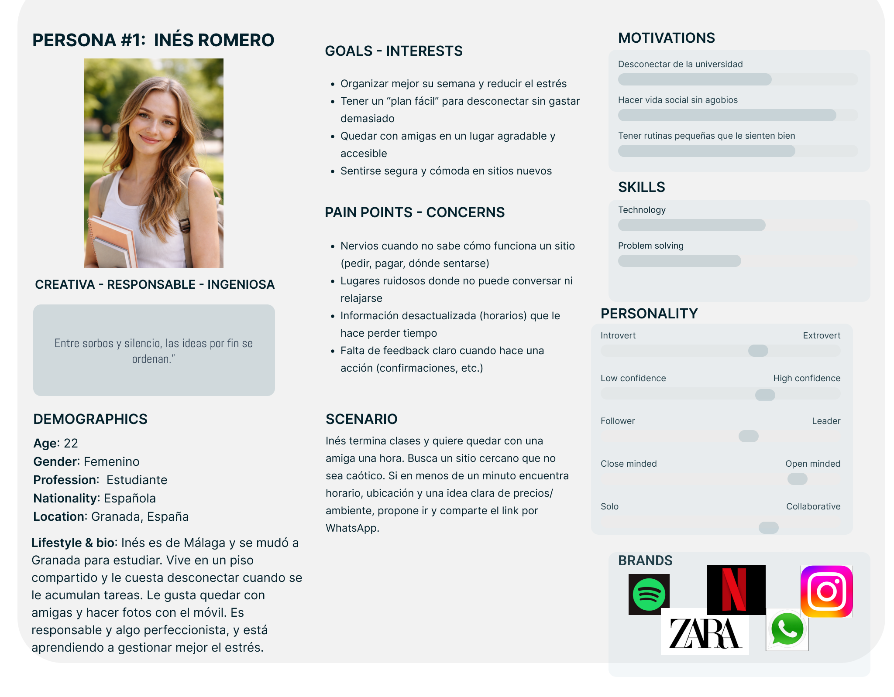
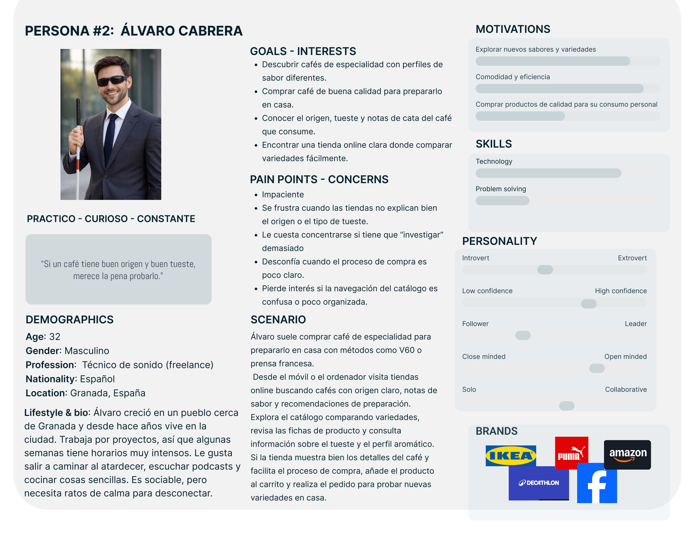
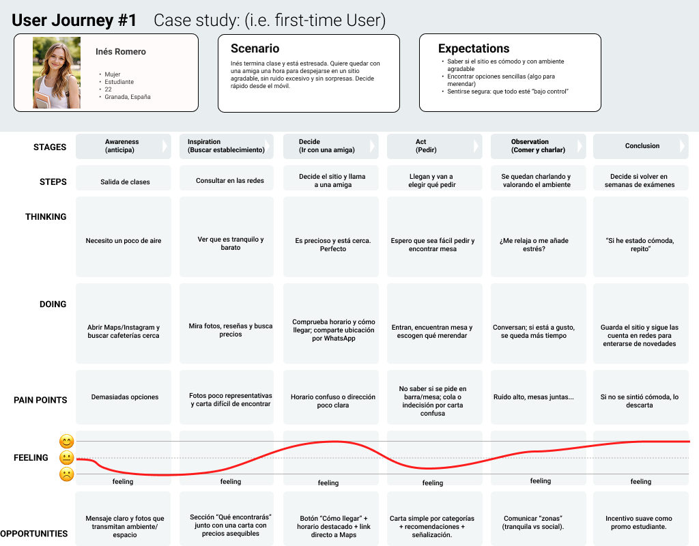
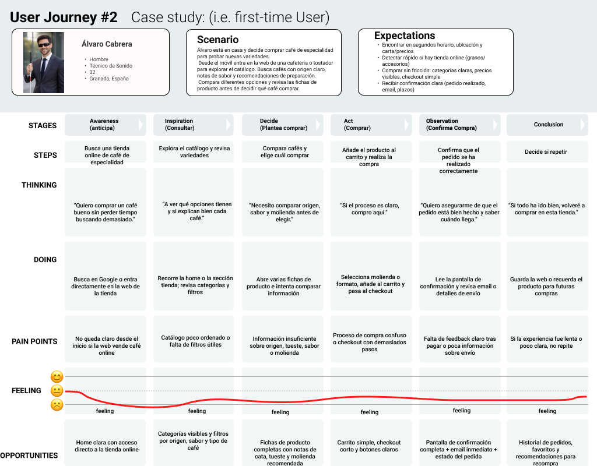

# DIU26
Prácticas Diseño Interfaces de Usuario (Tema: .... ) 

* [Guiones de prácticas](GuionesPracticas/)
* [Guía para crea tu Case Study](Guia_CaseStudy.md)
* Sala de la Fama [DIU Hall of fame](https://github.com/mgea/DIU/tree/master/hall_of_fame) donde se pueden encontrar Case Study destacados de otros años.

Actualizado: 14/01/2026

## Paso 0 My UX-Case Study
 
-----

Grupo: DIU2_LecheConCafé.  Curso: 2025/26 

Nombre del Proyecto: 

>>> Decida el nombre corto de su propuesta en la práctica 2 

Descripción: 

>>> Describa la idea de su producto en la práctica 2 

Logotipo: 

>>> Si diseña un logotipo para su producto en la práctica 3 pongalo aqui, a un tamaño adecuado. Si diseña un slogan añadalo aquí

Miembros y nombre del equipo:
 * :bust_in_silhouette:  Juan Carlos Vílchez Sánchez.
 GitHub: https://github.com/CarlosLinero9  :octocat:     
 * :bust_in_silhouette:  Iván García Hernández     :octocat:

 Falta el github.

>>> Los equipos son de 2 personas. Identifícaros con el nombre del Grupo y los enlaces a los perfiles de GitHub de cada integrante

----- 

 

# Proceso de Diseño 

 

## Paso 1. UX User & Desk Research & Analisis 

>>> Cualquier título puede ser adaptado. Recuerda borrar estos comentarios del template en tu documento

### 1.a User Reseach Plan
 
-----
Se ha seleccionado la página web de la cafetería "Despiertoo Speciality Coffee" para la realización del análisis. Hablamos de una de las mejores cafeterías de especialidad de España. Situada en Granada.

A pesar de que no tenemos un gusto muy refinado para el café, podemos acercarnos a este tipo de mercado/negocio a través del conocimiento de otras ramas del panorama gastronómico y slas posibles similitudes.

El principal objetivo de este análisis es aportar una experiencia óptima a cualquier consumidor del servicio, contribuyendo a la visibilidad del negocio y consecuentemente al aumento de ventas.

Para llevar a cabo este proyecto, realizamos una serie de comparativas con distintas cafeterías de especialidad tanto de España como del resto del mundo. Plantearemos además varios perfiles ficticios de posibles consumidores con el fin de estudiar como podemos atraer a estos a través de las fortalezas/virtudes de nuestro proyecto. Una vez planteado el público objetivo, trazamos un jouney map que permita ayudarnos a mejorar la experiencia de los usuarios al interactuar con el proyecto.
Para finalizar, buscamos identificar los problemas de usabilidad a través del usability review.

Aquí el documento UserResearchPlan: [Abrir PDF](./P1/1-UseResearchPlan/User_Research_Plan.pdf)

### 1.b Competitive Analysis
 
-----

Con la finalidad de llegar al mayor número de clientes posibles, llevamos a cabo una comparativa con dos tipos de cafeterías:

  - "Perspectives Cafe". Se trata de una cafetería situada en Calle Elvira, en Granada. Ofrece una gran variedad de productos. Desde cafés e infusiones hasta tostadas y bollería. URL: 'https://www.perspectives.cafe/'

  - "Coffee 1931". Hablamos de una tienda especializada en la preparación y venta de café de especialidad. Cuentan con una tienda online. URL: 'https://www.coffee1931.com/'

El fin de esta comparativa es dar el negocio a conocer tanto a un público más general como a uno  más específico a través del análisis comparativo de las ventajas y desventajas de ambas propuestas. 

<!--Echar un vistazo a esto-->
El objetivo de esta comparativa es entender qué elementos ayudan a comunicar el negocio a un público amplio (información práctica visible, oferta clara y navegación sencilla) y cuáles refuerzan el atractivo para un público más específico (detalle del producto, contenido, confianza y compra online). En general, la opción más “generalista” destaca por facilitar decisiones rápidas y reducir fricción en tareas básicas, mientras que la opción especializada aporta profundidad de información, sensación de calidad y canales de conversión adicionales. Como conclusión, buscamos combinar ambos enfoques: claridad inmediata para quien decide en segundos y, al mismo tiempo, herramientas y contenido que soporten la exploración y la compra online para usuarios más interesados.

Repasamos las principales ventajas de cada una de estas propuestas, valorando el potencial que pueden aportar al objetivo de este proyecto. Para ello, comparamos las 3 webs valorando de 0 a 3 estrellas los siguientes criterios:

<!-- Echar un ojo -->
### Criterios usados en el Competitive Analysis

Para comparar el caso principal con los competidores hemos utilizado criterios agrupados en cuatro bloques: **modelo de negocio**, **aspectos tecnológicos**, **funcionalidad y tareas clave**, y **usabilidad/experiencia**.

#### Business Model
- **Oferta y propuesta de valor:** evaluamos si la web comunica con claridad qué ofrece el negocio (producto/servicio principal) y qué lo diferencia.
- **Canales de venta (local + online):** valoramos si integra bien la experiencia presencial con canales digitales (tienda online, reservas, información de local, etc.).
- **Estrategia de captación (newsletter/CTA):** revisamos si existen llamadas a la acción claras (seguir en redes, suscripción, reserva, compra) y si están bien situadas.

#### Technological Issues
- **Rendimiento y carga en móvil:** comprobamos rapidez percibida y fluidez en navegación móvil, evitando esperas y páginas pesadas.
- **Confianza legal y privacidad:** verificamos la visibilidad de aviso legal, política de privacidad/cookies y, si hay compra online, señales de pago seguro y condiciones claras.
- **Soporte de idioma (ES/EN):** valoramos si permite cambiar de idioma y si la traducción es consistente en secciones importantes.

#### Functionality & Use
- **Info práctica (horarios/ubicación):** evaluamos si el usuario encuentra fácilmente dirección, horarios, contacto y acceso a mapa/ruta.
- **Exploración del catálogo (categorías/buscador):** revisamos si es sencillo localizar productos o contenidos mediante categorías, buscador y/o filtros/ordenación.
- **Compra online y checkout:** comprobamos si el flujo de compra es claro (añadir al carrito, revisar pedido, pago) y si minimiza fricción.

#### Usability
- **Claridad y escaneabilidad:** valoramos jerarquía visual, legibilidad y que la información clave se encuentre rápido sin exceso de scroll.
- **Feedback de acciones (carrito/confirmaciones):** revisamos si el sistema confirma acciones importantes (añadir al carrito, envío de formularios, compra) y evita incertidumbre.
- **Experiencia y ambiente (storytelling/fotos):** analizamos si la web transmite el estilo del lugar y la experiencia mediante fotos, tono y contenido coherente.

<!--Falta meter el competitive analysis con FIGMA-->
Aquí el documento CompetitiveAnalysis: [Abrir PDF](./P1/2-CompetitiveAnalysis/CompetitiveAnalysis.pdf)

[Ver Competitive Analysis](./P1/2-CompetitiveAnalysis/CompetitiveAnalysis.jpg)

### 1.c Personas
 
-----

Para esta práctica hemos definido dos perfiles distintos, con necesidades y objetivos diferentes. Por un lado, tenemos a Álvaro, un técnico de sonido freelance de 32 años que busca un lugar cercano donde hacer una pausa entre trabajos sin perder tiempo, encontrando rápido la información clave antes de decidir. Por otro lado, Inés es una estudiante de 22 años que quiere desconectar del estrés de la universidad y quedar con amigas en un sitio agradable y cómodo, con la seguridad de saber qué se va a encontrar antes de ir.

 

### 1.d User Journey Map
 
----
Hemos elegido estos dos casos de estudio para evaluar la experiencia de usuario en dos tareas muy habituales relacionadas con la cafetería: encontrar rápidamente la información esencial para decidir ir (horario, ubicación y carta/precios) y planificar una visita para quedar y pasar un rato sin sorpresas (ambiente y opciones disponibles). Queríamos reflejar también las fricciones que aparecen cuando la información no está bien organizada o es difícil de localizar desde el móvil. Lo más destacable es que, si los datos clave no son visibles a primera vista, el usuario pierde tiempo navegando y aumenta la incertidumbre: Álvaro abandona rápido si no puede decidir en segundos, e Inés se siente insegura si no puede confirmar fácilmente horarios, precios y “qué esperar” antes de ir.

 
 

### 1.e Usability Review
 
----

>>>  El objetivo es revisar la usabilidad del competidor seleccionado. Usamos un checklist de verificación. Tras usarlo, subelo a la carpeta P1/ Ofrece aquí un parrafo para:
>>> - Enlace al documento:  (xls/pdf) 
>>> - URL y Valoración numérica obtenida: 
>>> - Comentario sobre la revisión:  (puntos fuertes y débiles detectados)

 

## Paso 2. UX Design  

>>> Cualquier título puede ser adaptado. Recuerda borrar estos comentarios del template en tu documento

### 2.a Reframing / IDEACION: Feedback Capture Grid / EMpathy map 
 
----

>>> Comenta con un diagrama los aspectos más destacados a modo de conclusion de la práctica anterior. De qué carece la competencia?? Tu diagrama puede ser una figura subida a la carpeta P2/

 Interesante | Críticas     
| ------------- | -------
  Preguntas | Nuevas ideas
  
    
>>> Explica el Problema y plantea una hipótesis. Es decir, explica aquí qué 
>>> se plantea como "propuesta de valor" para un nuevo diseño de aplicación propio

### 2.b ScopeCanvas

----

>>> Propuesta de valor, pero ahora en vez de un texto es un ScopeCanvas que has subido a P2/ y enlazado desde aqui. Tambien vale una imagen miniatura del recurso.
>>> No olvides que tu propuesta ya tiene un nombre corto y puedes actualizar la cabecera de este archivo

### 2.b User Flow (task) analysis 
 
-----

>>> Definir "User Map" y "Task Flow" ... enlazar desde P2/ y describir brevemente

### 2.c IA: Sitemap + Labelling 
 
----

>>> Identificar términos para diálogo con usuario (evita el spanglish) y la arquitectura de la información. Es muy apropiado un diagrama tipo sitemap y una tabla que se ampliaría para llevar asociado la columna iconos (tanto para la web como para una app). 

Término | Significado     
| ------------- | -------
  Login  | acceder a plataforma

### 2.d Wireframes
 
-----

>>> Plantear el diseño del layout para Web/movil (organización y simulación). Describa la herramienta usada 

 

## Paso 3. Mi UX-Case Study (diseño)

>>> Cualquier título puede ser adaptado. Recuerda borrar estos comentarios del template en tu documento

### 3.a Moodboard

-----

>>> Diseño visual con una guía de estilos visual (moodboard) 
>>> Incluir Logotipo. Todos los recursos estarán subidos a la carpeta P3/
>>> Explique aqui la/s herramienta/s utilizada/s y el por qué de la resolución empleada. Reflexione ¿Se puede usar esta imagen como cabecera de Instagram, por ejemplo, o se necesitan otras?

### 3.b Landing Page
 
----

>>> Plantear el Landing Page del producto. Aplica estilos definidos en el moodboard

### 3.c Guidelines
 
----

>>> Estudio de Guidelines y explicación de los Patrones IU a usar 
>>> Es decir, tras documentarse, muestre las deciones tomadas sobre Patrones IU a usar para la fase siguiente de prototipado. 

### 3.d Mockup
 
----

>>> Consiste en tener un Layout en acción. Un Mockup es un prototipo HTML que permite simular tareas con estilo de IU seleccionado. Muy útil para compartir con stakeholders

 

## Paso 4. Pruebas de Evaluación 

### 4.a Reclutamiento de usuarios 

-----

>>> Breve descripción del caso asignado (llamado Caso-B) con enlace al repositorio Github
>>> Tabla y asignación de personas ficticias (o reales) a las pruebas. Exprese las ideas de posibles situaciones conflictivas de esa persona en las propuestas evaluadas. Mínimo 4 usuarios: asigne 2 al Caso A y 2 al caso B.

| Usuarios | Sexo/Edad     | Ocupación   |  Exp.TIC    | Personalidad | Plataforma | Caso
| ------------- | -------- | ----------- | ----------- | -----------  | ---------- | ----
| User1's name  | H / 18   | Estudiante  | Media       | Introvertido | Web.       | A 
| User2's name  | H / 18   | Estudiante  | Media       | Timido       | Web        | A 
| User3's name  | M / 35   | Abogado     | Baja        | Emocional    | móvil      | B 
| User4's name  | H / 18   | Estudiante  | Media       | Racional     | Web        | B 

### 4.b Diseño de las pruebas 
 
-----

>>> Planifique qué pruebas se van a desarrollar. ¿En qué consisten? ¿Se hará uso del checklist de la P1?

### 4.c Cuestionario SUS
 
----

>>> Como uno de los test para la prueba A/B testing, usaremos el **Cuestionario SUS** que permite valorar la satisfacción de cada usuario con el diseño utilizado (casos A o B). Para calcular la valoración numérica y la etiqueta linguistica resultante usamos la [hoja de cálculo](https://github.com/mgea/DIU19/blob/master/Cuestionario%20SUS%20DIU.xlsx). Previamente conozca en qué consiste la escala SUS y cómo se interpretan sus resultados
http://usabilitygeek.com/how-to-use-the-system-usability-scale-sus-to-evaluate-the-usability-of-your-website/)
Para más información, consultar aquí sobre la [metodología SUS](https://cui.unige.ch/isi/icle-wiki/_media/ipm:test-suschapt.pdf)
>>> Adjuntar en la carpeta P4/ el excel resultante y describa aquí la valoración personal de los resultados 

### 4.d A/B Testing
 
-----

>>> Los resultados de un A/B testing con 3 pruebas y 2 casos o alternativas daría como resultado una tabla de 3 filas y 2 columnas, además de un resultado agregado global. Especifique con claridad el resultado: qué caso es más usable, A o B?

### 4.e Aplicación del método Eye Tracking 

----

>>> Indica cómo se diseña el experimento y se reclutan los usuarios. Explica la herramienta / uso de gazerecorder.com u otra similar. Aplíquese únicamente al caso B.

  
>>> Cambiar esta img por una de vuestro experimento. El recurso deberá estar subido a la carpeta P4/  

>>> gazerecorder en versión de pruebas puede estar limitada a 3 usuarios para generar mapa de calor (crédito > 0 para que funcione) 

### 4.f Usability Report de B
 
-----

>>> Añadir report de usabilidad para práctica B (la de los compañeros) aportando resultados y valoración de cada debilidad de usabilidad. 
>>> Enlazar aqui con el archivo subido a P4/ que indica qué equipo evalua a qué otro equipo.

>>> Complementad el Case Study en su Paso 4 con una Valoración personal del equipo sobre esta tarea

 

## Paso 5. Exportación y Documentación 

### 5.a Exportación a HTML/React
 
----

>>> Breve descripción de esta tarea. Las evidencias de este paso quedan subidas a P5/

### 5.b Documentación con Storybook

----

>>> Breve descripción de esta tarea. Las evidencias de este paso quedan subidas a P5/

 

## Conclusiones finales & Valoración de las prácticas

>>> Opinión FINAL del proceso de desarrollo de diseño siguiendo metodología UX y valoración (positiva /negativa) de los resultados obtenidos. ¿Qué se puede mejorar? Recuerda que este tipo de texto se debe eliminar del template que se os proporciona 

