# DIU26
Prácticas Diseño Interfaces de Usuario (Tema: .... ) 

* [Guiones de prácticas](GuionesPracticas/)
* [Guía para crea tu Case Study](Guia_CaseStudy.md)
* Sala de la Fama [DIU Hall of fame](https://github.com/mgea/DIU/tree/master/hall_of_fame) donde se pueden encontrar Case Study destacados de otros años.

Actualizado: 14/01/2026

## Paso 0 My UX-Case Study
 
-----

Grupo: DIU2_LecheConCafé.  Curso: 2025/26 

Nombre del Proyecto: 

Punto Café

Descripción: 

Punto Café es una plataforma web/móvil para descubrir cafeterías de especialidad de forma rápida y clara. Su objetivo es facilitar tanto la decisión inmediata de visita —mostrando horarios, ubicación, carta, precios y ambiente— como la exploración y compra online de café mediante filtros útiles, ayuda contextual y recomendaciones para usuarios expertos y principiantes.

Logotipo: 

>>> Si diseña un logotipo para su producto en la práctica 3 pongalo aqui, a un tamaño adecuado. Si diseña un slogan añadalo aquí

Miembros y nombre del equipo:
 * :bust_in_silhouette:  Juan Carlos Vílchez Sánchez.
 GitHub: https://github.com/CarlosLinero9  :octocat:     
 * :bust_in_silhouette:  Iván García Hernández
 GitHub: https://github.com/ivaangh :octocat:

----- 

 

# Proceso de Diseño 

 

## Paso 1. UX User & Desk Research & Analisis 

### 1.a User Reseach Plan
 
-----
Se ha seleccionado la página web de la cafetería "Despiertoo Speciality Coffee" para la realización del análisis. Hablamos de una de las mejores cafeterías de especialidad de España. Situada en Granada.

A pesar de que no tenemos un gusto muy refinado para el café, podemos acercarnos a este tipo de mercado/negocio a través del conocimiento de otras ramas del panorama gastronómico y slas posibles similitudes.

El principal objetivo de este análisis es aportar una experiencia óptima a cualquier consumidor del servicio, contribuyendo a la visibilidad del negocio y consecuentemente al aumento de ventas.

Para llevar a cabo este proyecto, realizamos una serie de comparativas con distintas cafeterías de especialidad tanto de España como del resto del mundo. Plantearemos además varios perfiles ficticios de posibles consumidores con el fin de estudiar como podemos atraer a estos a través de las fortalezas/virtudes de nuestro proyecto. Una vez planteado el público objetivo, trazamos un jouney map que permita ayudarnos a mejorar la experiencia de los usuarios al interactuar con el proyecto.
Para finalizar, buscamos identificar los problemas de usabilidad a través del usability review.

Aquí el documento UserResearchPlan: [Abrir PDF](./P1/1-UseResearchPlan/User_Research_Plan.pdf)

### 1.b Competitive Analysis
 
-----

Con la finalidad de llegar al mayor número de clientes posibles, llevamos a cabo una comparativa con dos tipos de cafeterías:

  - "Perspectives Cafe". Se trata de una cafetería situada en Calle Elvira, en Granada. Ofrece una gran variedad de productos. Desde cafés e infusiones hasta tostadas y bollería. URL: 'https://www.perspectives.cafe/es/'

  - "Coffee 1931". Hablamos de una tienda especializada en la preparación y venta de café de especialidad. Cuentan con una tienda online. URL: 'https://www.coffee1931.com/'

El fin de esta comparativa es dar el negocio a conocer tanto a un público más general como a uno  más específico a través del análisis comparativo de las ventajas y desventajas de ambas propuestas. 

<!--Echar un vistazo a esto-->
El objetivo de esta comparativa es entender qué elementos ayudan a comunicar el negocio a un público amplio (información práctica visible, oferta clara y navegación sencilla) y cuáles refuerzan el atractivo para un público más específico (detalle del producto, contenido, confianza y compra online). En general, la opción más “generalista” destaca por facilitar decisiones rápidas y reducir fricción en tareas básicas, mientras que la opción especializada aporta profundidad de información, sensación de calidad y canales de conversión adicionales. Como conclusión, buscamos combinar ambos enfoques: claridad inmediata para quien decide en segundos y, al mismo tiempo, herramientas y contenido que soporten la exploración y la compra online para usuarios más interesados.

Repasamos las principales ventajas de cada una de estas propuestas, valorando el potencial que pueden aportar al objetivo de este proyecto. Para ello, comparamos las 3 webs valorando de 0 a 3 estrellas los siguientes criterios:

<!-- Echar un ojo -->
### Criterios usados en el Competitive Analysis

Para comparar el caso principal con los competidores hemos utilizado criterios agrupados en cuatro bloques: **modelo de negocio**, **aspectos tecnológicos**, **funcionalidad y tareas clave**, y **usabilidad/experiencia**.

#### Business Model
- **Oferta y propuesta de valor:** evaluamos si la web comunica con claridad qué ofrece el negocio (producto/servicio principal) y qué lo diferencia.
- **Canales de venta (local + online):** valoramos si integra bien la experiencia presencial con canales digitales (tienda online, reservas, información de local, etc.).
- **Estrategia de captación (newsletter/CTA):** revisamos si existen llamadas a la acción claras (seguir en redes, suscripción, reserva, compra) y si están bien situadas.

#### Technological Issues
- **Rendimiento y carga en móvil:** comprobamos rapidez percibida y fluidez en navegación móvil, evitando esperas y páginas pesadas.
- **Confianza legal y privacidad:** verificamos la visibilidad de aviso legal, política de privacidad/cookies y, si hay compra online, señales de pago seguro y condiciones claras.
- **Soporte de idioma (ES/EN):** valoramos si permite cambiar de idioma y si la traducción es consistente en secciones importantes.

#### Functionality & Use
- **Info práctica (horarios/ubicación):** evaluamos si el usuario encuentra fácilmente dirección, horarios, contacto y acceso a mapa/ruta.
- **Exploración del catálogo (categorías/buscador):** revisamos si es sencillo localizar productos o contenidos mediante categorías, buscador y/o filtros/ordenación.
- **Compra online y checkout:** comprobamos si el flujo de compra es claro (añadir al carrito, revisar pedido, pago) y si minimiza fricción.

#### Usability
- **Claridad y escaneabilidad:** valoramos jerarquía visual, legibilidad y que la información clave se encuentre rápido sin exceso de scroll.
- **Feedback de acciones (carrito/confirmaciones):** revisamos si el sistema confirma acciones importantes (añadir al carrito, envío de formularios, compra) y evita incertidumbre.
- **Experiencia y ambiente (storytelling/fotos):** analizamos si la web transmite el estilo del lugar y la experiencia mediante fotos, tono y contenido coherente.

<!--Falta meter el competitive analysis con FIGMA-->
Aquí el documento CompetitiveAnalysis: [Abrir PDF](./P1/2-CompetitiveAnalysis/CompetitiveAnalysis.pdf)

[Ver Competitive Analysis](./P1/2-CompetitiveAnalysis/CompetitiveAnalysis.jpg)

### 1.c Personas
 
-----

Para esta práctica hemos definido dos perfiles distintos, con necesidades y objetivos diferentes. Por un lado, tenemos a Álvaro, un técnico de sonido freelance de 32 años que busca un lugar cercano donde hacer una pausa entre trabajos sin perder tiempo, encontrando rápido la información clave antes de decidir. Por otro lado, Inés es una estudiante de 22 años que quiere desconectar del estrés de la universidad y quedar con amigas en un sitio agradable y cómodo, con la seguridad de saber qué se va a encontrar antes de ir.

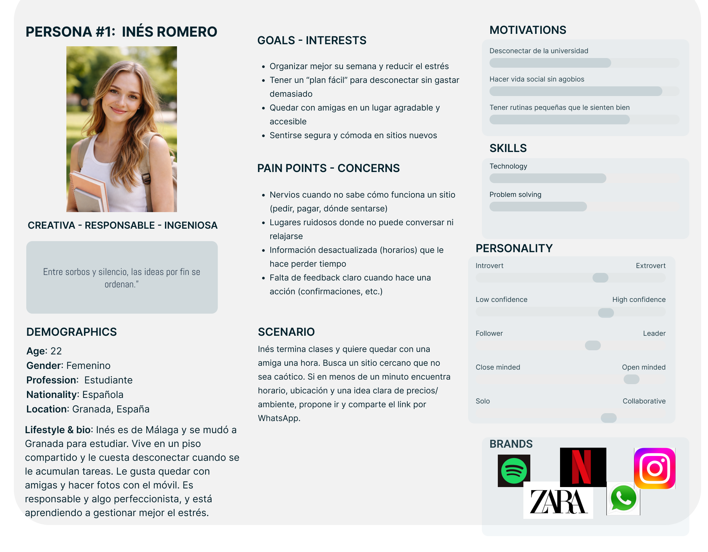 
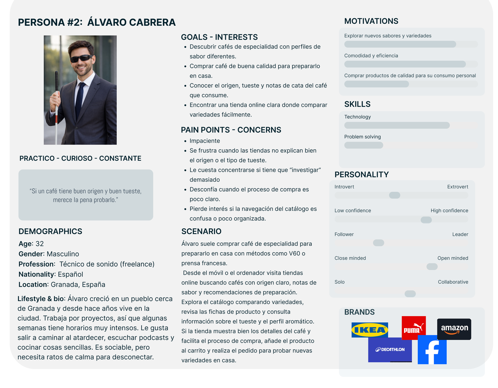

### 1.d User Journey Map
 
----
Hemos elegido estos dos casos de estudio para evaluar la experiencia de usuario en dos tareas muy habituales relacionadas con la cafetería: encontrar rápidamente la información esencial para decidir ir (horario, ubicación y carta/precios) y planificar una visita para quedar y pasar un rato sin sorpresas (ambiente y opciones disponibles). Queríamos reflejar también las fricciones que aparecen cuando la información no está bien organizada o es difícil de localizar desde el móvil. Lo más destacable es que, si los datos clave no son visibles a primera vista, el usuario pierde tiempo navegando y aumenta la incertidumbre: Álvaro abandona rápido si no puede decidir en segundos, e Inés se siente insegura si no puede confirmar fácilmente horarios, precios y “qué esperar” antes de ir.

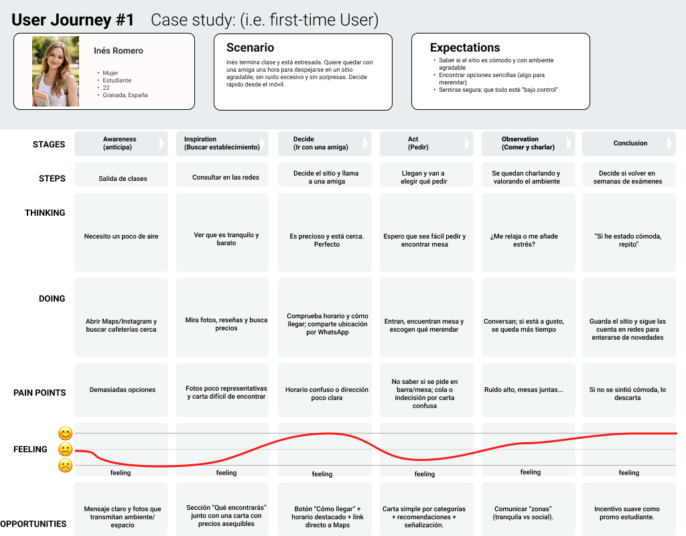 
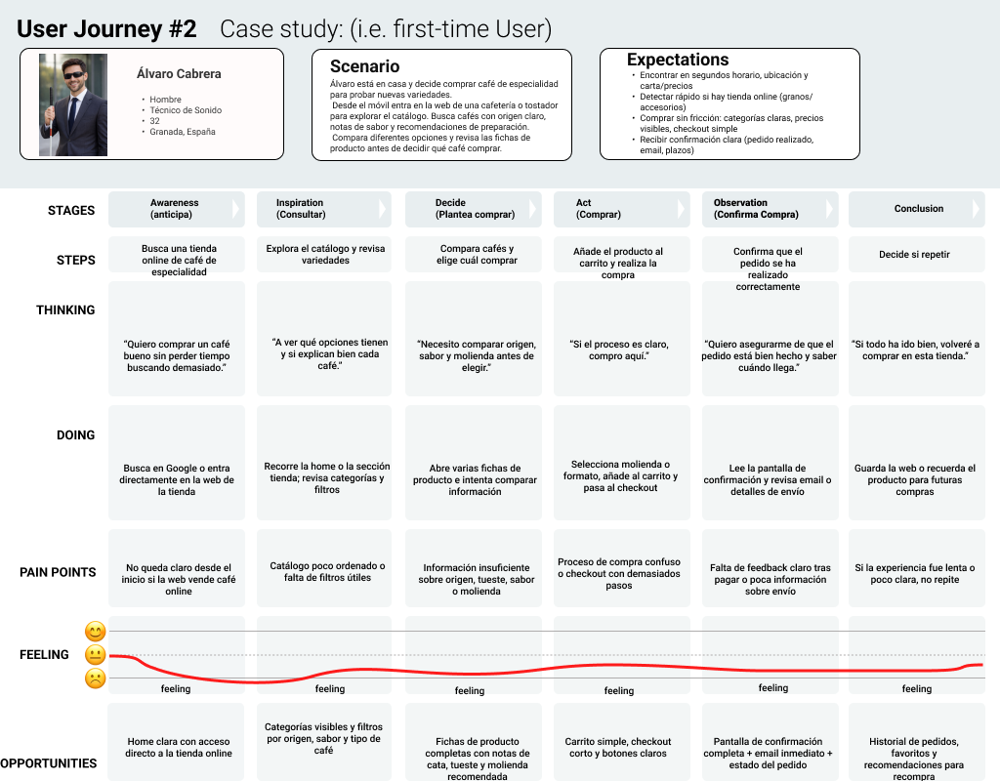 

### 1.e Usability Review
 
----
**Valoración numérica obtenida:** 74 – *Good*

**Comentario sobre la revisión:**  
La puntuación nos parece coherente porque, en general, el sitio permite completar las tareas principales con relativa facilidad (consultar información práctica del local y acceder a la tienda online). Destaca que la **ubicación/horarios y el contacto** están bastante accesibles y que existen **secciones legales** visibles, lo que aporta confianza. Como puntos mejorables, se nota la falta de un **buscador/filtros más potentes** en la tienda, y también que la web es bastante visual, lo que puede requerir más *scroll* y hacer menos “rápida” la búsqueda de información en móvil. Además, sería recomendable reforzar la **ayuda contextual** (FAQ, guía de compra/molienda/envíos) y el **feedback** en acciones clave de compra para reducir incertidumbre.

Aquí el documento UsabilityReview: [Abrir PDF](./P1/5-UsabilityReview/UsabilityReview.pdf)

### 1.f Briefing Final
Como se planteó en el *Research Plan*, el objetivo de esta práctica ha sido analizar la UX de **Despiertoo Speciality Coffee** para mejorar la experiencia de usuario y aumentar su visibilidad entre un público más joven, especialmente en móvil.

Para ello, comenzamos con un análisis comparativo frente a dos alternativas con enfoques distintos: **Perspectives** (orientada a atraer público general con una comunicación clara del local y su ambiente) y **Coffee 1931** (más centrada en el producto y la venta online, con una estructura de tienda más completa). Este contraste nos permitió identificar buenas prácticas para dos necesidades: la decisión rápida de visita (información práctica a primera vista) y la exploración/compra online (categorías, buscador y confianza en el *checkout*).

Después, evaluamos la experiencia desde dos perfiles: **Álvaro**, que decide con prisa y abandona si no encuentra en segundos horario, ubicación o carta, o si la compra online genera dudas; e **Inés**, que prioriza seguridad y claridad para quedar sin sorpresas.

Finalmente, la revisión de usabilidad (**74 – Good**) confirma que el sitio funciona bien en lo esencial (contacto, horarios, confianza legal), pero es mejorable en la exploración de la tienda (falta de buscador/filtros), la escaneabilidad en móvil (exceso de *scroll*) y el *feedback*/ayuda contextual (guías rápidas, confirmaciones y preguntas frecuentes).

Como conclusión, el sistema tiene una base sólida y potencial, pero debería reforzar el acceso inmediato a la información clave, mejorar la navegación del catálogo y simplificar/clarificar el proceso de compra para reducir incertidumbre y aumentar conversión.

Aquí el documento BriefingFinal: [Ver Briefing Final](./P1/6-BriefingFinal/BriefingFinal.pdf)
 

## Paso 2. UX Design  

### 2.a Reframing / IDEACION: Feedback Capture Grid / EMpathy map 
 
----    

Como conclusión de la práctica anterior, hemos sintetizado los principales hallazgos mediante un Feedback Capture Grid, con el objetivo de reformular el problema de diseño a partir del análisis competitivo, las personas, los journey maps y la usability review. En nuestro caso, el estudio muestra que la experiencia actual tiene una base sólida, pero todavía presenta fricciones en tareas clave, especialmente en móvil: encontrar rápidamente la información esencial del local, explorar la tienda con claridad, ofrecer información detallada sobre las distintas especialidades de café y comprar con confianza.

Tras comparar distintas referencias, observamos que la competencia suele resolver mejor unas necesidades que otras: algunas propuestas facilitan la decisión rápida de visita gracias a una comunicación más inmediata del local, mientras que otras destacan en la profundidad del catálogo y la compra online. Sin embargo, detectamos que sigue faltando una experiencia que una de forma clara estas dos dimensiones: información práctica visible + exploración guiada del café + apoyo al usuario menos experto, todo ello con una navegación eficiente y orientada a móvil.

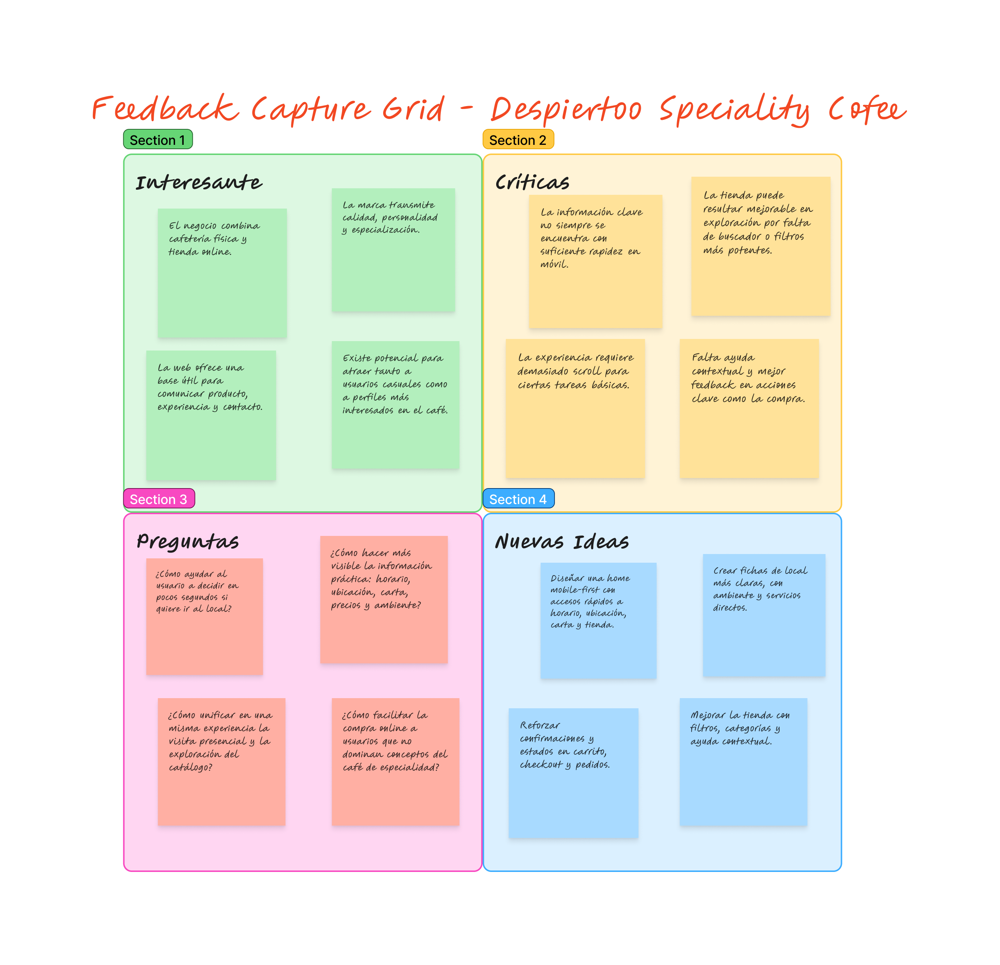 

#### Problema e Hipótesis
La experiencia digital actual comunica bien la identidad de la cafetería, pero no facilita de forma suficientemente rápida y clara las dos tareas principales del usuario: decidir una visita al local y explorar/comprar café online con seguridad y garantizando una decisión informada, especialmente desde el móvil. Cuando la información práctica no aparece de inmediato o la tienda exige demasiado esfuerzo de exploración, aumenta la incertidumbre y disminuyen la confianza del usuario y la eficiencia de uso.

Nuestra hipótesis de diseño plantea que, si desarrollamos una experiencia mobile-first que priorice desde la primera pantalla la información práctica del local —como horario, ubicación, carta y ambiente— y que además simplifique la exploración del catálogo mediante filtros, ayuda contextual, más detalles de cada producto (para los más expertos) y mejor feedback en las acciones de compra, los usuarios podrán tomar decisiones más rápidas, comprender mejor la oferta y completar sus objetivos con mayor confianza y menos fricción. A partir de esta idea, la propuesta de valor de nuestro nuevo diseño consiste en crear una plataforma digital para una cafetería de especialidad que integre en una sola experiencia la decisión rápida de visita al local y la compra guiada de café, ofreciendo una navegación clara, útil y accesible tanto para usuarios expertos como para quienes se están iniciando en este tipo de producto.

Aquí el FeedBackCaptureGrid: [FeedBack Capture Grid](./P2/1-FeedBackCaptureGrid/FeedBackCaptureGrid.pdf)

### 2.b ScopeCanvas

----

Nuestra propuesta de valor consiste en diseñar una experiencia digital para una cafetería de especialidad que permita a los usuarios resolver de forma rápida y clara sus dos necesidades principales: decidir si quieren visitar el local y explorar/comprar café online con confianza.

Para ello, proponemos una plataforma mobile-first que reúna en una sola experiencia la información práctica del establecimiento —horario, ubicación, carta, precios y ambiente— junto con una tienda mejor organizada, con filtros, ayuda contextual y recomendaciones para usuarios expertos y principiantes.

De este modo, el nuevo diseño no solo mejora la rapidez de acceso a la información, sino que también reduce la incertidumbre durante la navegación y facilita la conversión tanto en visita presencial como en compra digital.

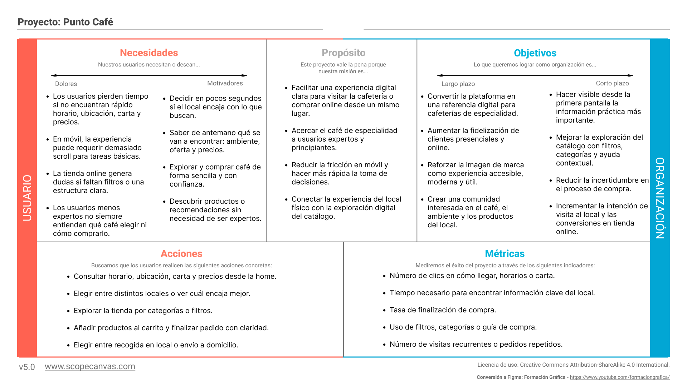 

### 2.b User Flow (task) analysis 
 
-----

>>> Definir "User Map" y "Task Flow" ... enlazar desde P2/ y describir brevemente

Hemos definido dos user flows principales a partir de las tareas más relevantes detectadas en la práctica 1. El primero representa el recorrido del usuario que necesita decidir rápidamente si visitar la cafetería, consultando información esencial como horario, ubicación, carta, precios y ambiente. El segundo muestra el flujo de exploración y compra de café online, incluyendo búsqueda o filtrado de productos, consulta de ayuda contextual y proceso de compra. Ambos flujos están orientados a reducir la incertidumbre, mejorar la navegación móvil y facilitar las acciones clave del usuario.

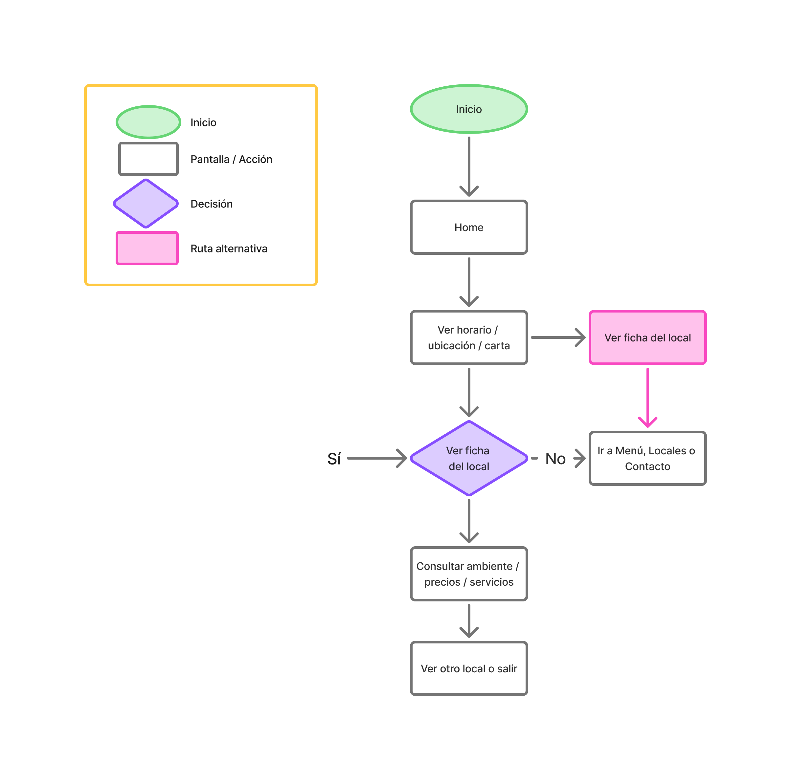

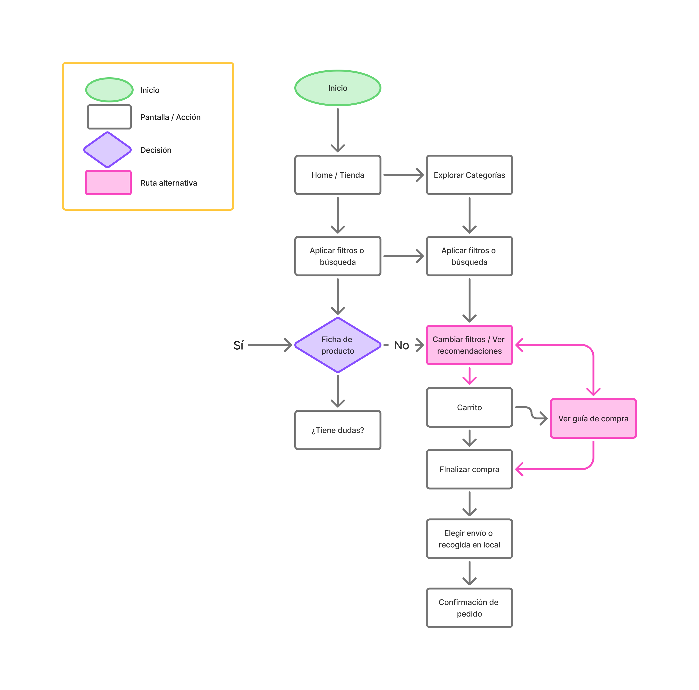

Para consultar el pdf de los User Flow:
[UserFlow1](./P2/3-UserFlows/UserFlows1.pdf)
[UserFlow2](./P2/3-UserFlows/UserFlows2.pdf)

#### User Task Matrix
Hemos valorado las tareas según la prioridad o relevancia para los distintos tipos de usuario. 
Las categorías empleadas son:

- Alta: tarea principal para ese tipo de usuario.
- Media: tarea secundaria o de apoyo.
- Baja: tarea ocasional o poco frecuente.
- - : no tiene acceso a esa funcionalidad.

| Tarea | Usuarios no registrados | Usuarios registrados | Administrador |
|-------|--------------------------|----------------------|---------------|
| Iniciar sesión | - | Alta | Alta |
| Cerrar sesión | - | Media | Alta |
| Registrarse | Alta | - | - |
| Consultar horario y ubicación | Alta | Alta | Media |
| Ver carta | Alta | Alta | Media |
| Ver ficha del local | Alta | Alta | Media |
| Buscar producto | Alta | Alta | Media |
| Filtrar productos | Alta | Alta | Media |
| Ver ficha de producto | Alta | Alta | Media |
| Ver guía de compra | Alta | Alta | Baja |
| Añadir al carrito | - | Alta | Baja |
| Ir al carrito | - | Alta | Baja |
| Finalizar compra | - | Alta | Baja |
| Elegir envío o recogida | - | Alta | Baja |
| Cancelar compra | - | Media | Baja |
| Editar perfil | - | Alta | Alta |
| Ver historial de pedidos | - | Alta | Alta |
| Gestionar productos | - | - | Alta |
| Gestionar pedidos | - | - | Alta |
| Actualizar horarios/locales | - | - | Alta |
 

### 2.c IA: Sitemap + Labelling 
 
----

>>> Identificar términos para diálogo con usuario (evita el spanglish) y la arquitectura de la información. Es muy apropiado un diagrama tipo sitemap y una tabla que se ampliaría para llevar asociado la columna iconos (tanto para la web como para una app). 

#### Sitemap
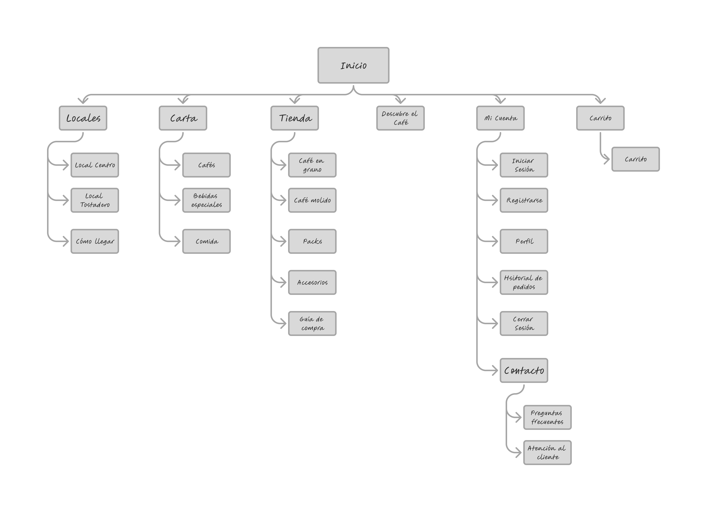
 Consulta el sitemap aquí: [Sitemap](./P2/4-Sitemap/Sitemap.pdf)

#### Labelling

| Término | Icono | Significado |
|-------------------|----------------|--------------|
| Inicio | 🏠 | Volver al punto de entrada |
| Locales | 📍 | Buscar información del local |
| Cómo llegar | 🗺️ | Abrir mapa y ruta |
| Carta | ☕ | Consultar oferta del local |
| Cafés | ☕ | Ver tipos de café |
| Bebidas especiales | 🧋 | Ver bebidas de autor |
| Comida | 🥐 | Ver comida disponible |
| Precios | 💶 | Consultar precios |
| Tienda | 🛍️ | Comprar productos online |
| Café en grano | 🌰 | Ver café sin moler |
| Café molido | 🫘 | Ver café molido |
| Packs | 🎁 | Ver lotes/ofertas |
| Accesorios | 🧰 | Ver complementos |
| Guía de compra | 📖 | Ayuda para elegir |
| Descubre el café | 🔎 | Explorar contenido educativo |
| Métodos de preparación | ⚙️ | Cómo preparar café |
| Tipos de molienda | 🌀 | Elegir molienda adecuada |
| Orígenes y sabores | 🌍 | Conocer origen y notas |
| Mi cuenta | 👤 | Gestión de usuario |
| Iniciar sesión | 🔐 | Acceder a cuenta |
| Registrarse | ✍️ | Crear cuenta |
| Perfil | 🪪 | Editar datos |
| Historial de pedidos | 📦 | Ver pedidos anteriores |
| Cerrar sesión | 🚪 | Salir de la cuenta |
| Carrito | 🛒 | Revisar compra |
| Contacto | ✉️ | Soporte / comunicación |
| Preguntas frecuentes | ❓ | Resolver dudas |
| Atención al cliente | 🎧 | Contactar con soporte |

La arquitectura de la información se ha estructurado diferenciando claramente la experiencia presencial (Locales y Carta) de la experiencia de compra online (Tienda y Carrito), incorporando además una sección de apoyo (“Descubre el café”) para reducir la incertidumbre de usuarios principiantes.

En el labelling se han evitado anglicismos como “Login” o “Checkout”, optando por términos claros en castellano que faciliten la comprensión y coherencia del sistema.

### 2.d Wireframes
 
-----

Como parte del proceso de diseño de la interfaz, se desarrollaron varios wireframes en baja fidelidad (Lo-Fi) con el objetivo de definir la estructura básica de las pantallas principales de la aplicación web. Estos esquemas permiten organizar la información, establecer la jerarquía visual de los elementos y comprobar la lógica de navegación antes de entrar en decisiones más detalladas relacionadas con el estilo gráfico o la estética final.

En una primera fase, las ideas se plantearon de forma esquemática a partir de bocetos previos, centrándose en la disposición de los contenidos y en la funcionalidad de cada pantalla. Posteriormente, estos planteamientos se trasladaron a Figma, donde se construyeron versiones más ordenadas y consistentes en blanco y negro, manteniendo un enfoque simple y funcional propio de los wireframes. De este modo, fue posible trabajar con una propuesta clara, homogénea y fácil de iterar.

Los wireframes recogen las vistas principales del proyecto, entre ellas la pantalla de locales, la carta, la tienda, la sección informativa sobre el café, el área de cuenta personal, el carrito y el apartado de contacto. Todas estas pantallas se han diseñado para facilitar la navegación del usuario, ofrecer una estructura comprensible y responder de forma clara a las necesidades detectadas durante las fases previas del análisis.

#### Bocetos
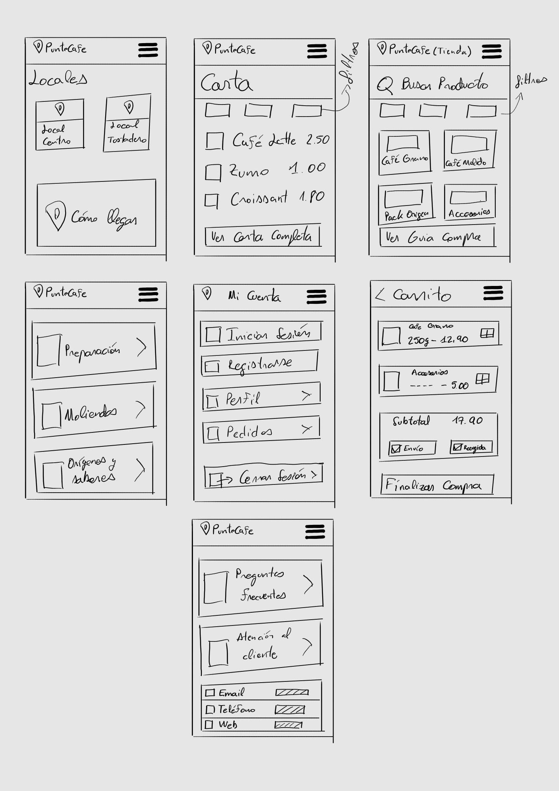

 Consulta el boceto aquí: [Boceto](./P2/5-Wireframe/boceto.pdf)

#### Pantalla Principal
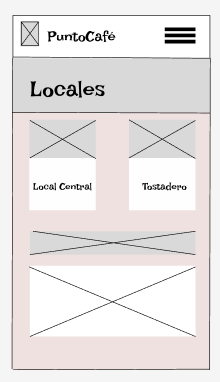

#### Carta
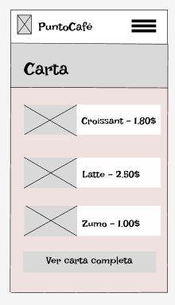

#### Tienda y carrito
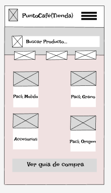
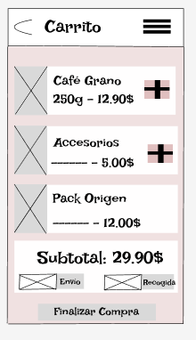

#### Perfil
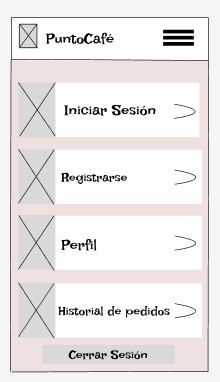

#### Contacto, información y FAQ
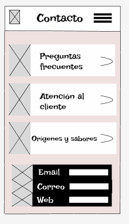
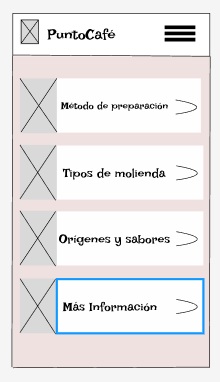

Aquí una imagen de todos los apartados anteriores:
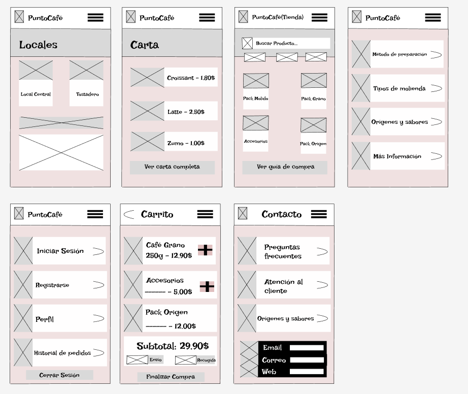

 

## Paso 3. Mi UX-Case Study (diseño)

>>> Cualquier título puede ser adaptado. Recuerda borrar estos comentarios del template en tu documento

### 3.a Moodboard

-----

>>> Diseño visual con una guía de estilos visual (moodboard) 
>>> Incluir Logotipo. Todos los recursos estarán subidos a la carpeta P3/
>>> Explique aqui la/s herramienta/s utilizada/s y el por qué de la resolución empleada. Reflexione ¿Se puede usar esta imagen como cabecera de Instagram, por ejemplo, o se necesitan otras?

### 3.b Landing Page
 
----

>>> Plantear el Landing Page del producto. Aplica estilos definidos en el moodboard

### 3.c Guidelines
 
----

>>> Estudio de Guidelines y explicación de los Patrones IU a usar 
>>> Es decir, tras documentarse, muestre las deciones tomadas sobre Patrones IU a usar para la fase siguiente de prototipado. 

### 3.d Mockup
 
----

>>> Consiste en tener un Layout en acción. Un Mockup es un prototipo HTML que permite simular tareas con estilo de IU seleccionado. Muy útil para compartir con stakeholders

 

## Paso 4. Pruebas de Evaluación 

### 4.a Reclutamiento de usuarios 

-----

>>> Breve descripción del caso asignado (llamado Caso-B) con enlace al repositorio Github
>>> Tabla y asignación de personas ficticias (o reales) a las pruebas. Exprese las ideas de posibles situaciones conflictivas de esa persona en las propuestas evaluadas. Mínimo 4 usuarios: asigne 2 al Caso A y 2 al caso B.

| Usuarios | Sexo/Edad     | Ocupación   |  Exp.TIC    | Personalidad | Plataforma | Caso
| ------------- | -------- | ----------- | ----------- | -----------  | ---------- | ----
| User1's name  | H / 18   | Estudiante  | Media       | Introvertido | Web.       | A 
| User2's name  | H / 18   | Estudiante  | Media       | Timido       | Web        | A 
| User3's name  | M / 35   | Abogado     | Baja        | Emocional    | móvil      | B 
| User4's name  | H / 18   | Estudiante  | Media       | Racional     | Web        | B 

### 4.b Diseño de las pruebas 
 
-----

>>> Planifique qué pruebas se van a desarrollar. ¿En qué consisten? ¿Se hará uso del checklist de la P1?

### 4.c Cuestionario SUS
 
----

>>> Como uno de los test para la prueba A/B testing, usaremos el **Cuestionario SUS** que permite valorar la satisfacción de cada usuario con el diseño utilizado (casos A o B). Para calcular la valoración numérica y la etiqueta linguistica resultante usamos la [hoja de cálculo](https://github.com/mgea/DIU19/blob/master/Cuestionario%20SUS%20DIU.xlsx). Previamente conozca en qué consiste la escala SUS y cómo se interpretan sus resultados
http://usabilitygeek.com/how-to-use-the-system-usability-scale-sus-to-evaluate-the-usability-of-your-website/)
Para más información, consultar aquí sobre la [metodología SUS](https://cui.unige.ch/isi/icle-wiki/_media/ipm:test-suschapt.pdf)
>>> Adjuntar en la carpeta P4/ el excel resultante y describa aquí la valoración personal de los resultados 

### 4.d A/B Testing
 
-----

>>> Los resultados de un A/B testing con 3 pruebas y 2 casos o alternativas daría como resultado una tabla de 3 filas y 2 columnas, además de un resultado agregado global. Especifique con claridad el resultado: qué caso es más usable, A o B?

### 4.e Aplicación del método Eye Tracking 

----

>>> Indica cómo se diseña el experimento y se reclutan los usuarios. Explica la herramienta / uso de gazerecorder.com u otra similar. Aplíquese únicamente al caso B.

  
>>> Cambiar esta img por una de vuestro experimento. El recurso deberá estar subido a la carpeta P4/  

>>> gazerecorder en versión de pruebas puede estar limitada a 3 usuarios para generar mapa de calor (crédito > 0 para que funcione) 

### 4.f Usability Report de B
 
-----

>>> Añadir report de usabilidad para práctica B (la de los compañeros) aportando resultados y valoración de cada debilidad de usabilidad. 
>>> Enlazar aqui con el archivo subido a P4/ que indica qué equipo evalua a qué otro equipo.

>>> Complementad el Case Study en su Paso 4 con una Valoración personal del equipo sobre esta tarea

 

## Paso 5. Exportación y Documentación 

### 5.a Exportación a HTML/React
 
----

>>> Breve descripción de esta tarea. Las evidencias de este paso quedan subidas a P5/

### 5.b Documentación con Storybook

----

>>> Breve descripción de esta tarea. Las evidencias de este paso quedan subidas a P5/

 

## Conclusiones finales & Valoración de las prácticas

>>> Opinión FINAL del proceso de desarrollo de diseño siguiendo metodología UX y valoración (positiva /negativa) de los resultados obtenidos. ¿Qué se puede mejorar? Recuerda que este tipo de texto se debe eliminar del template que se os proporciona 

