# DIU26
Prácticas Diseño Interfaces de Usuario (Tema: .... ) 

* [Guiones de prácticas](GuionesPracticas/)
* [Guía para crea tu Case Study](Guia_CaseStudy.md)
* Sala de la Fama [DIU Hall of fame](https://github.com/mgea/DIU/tree/master/hall_of_fame) donde se pueden encontrar Case Study destacados de otros años.

Actualizado: 14/01/2026

## Paso 0 My UX-Case Study
 
-----

Grupo: DIU2_LecheConCafé.  Curso: 2025/26 

Nombre del Proyecto: 

Punto Café

Descripción: 

Punto Café es una plataforma web/móvil para descubrir cafeterías de especialidad de forma rápida y clara. Su objetivo es facilitar tanto la decisión inmediata de visita —mostrando horarios, ubicación, carta, precios y ambiente— como la exploración y compra online de café mediante filtros útiles, ayuda contextual y recomendaciones para usuarios expertos y principiantes.

Logotipo: 

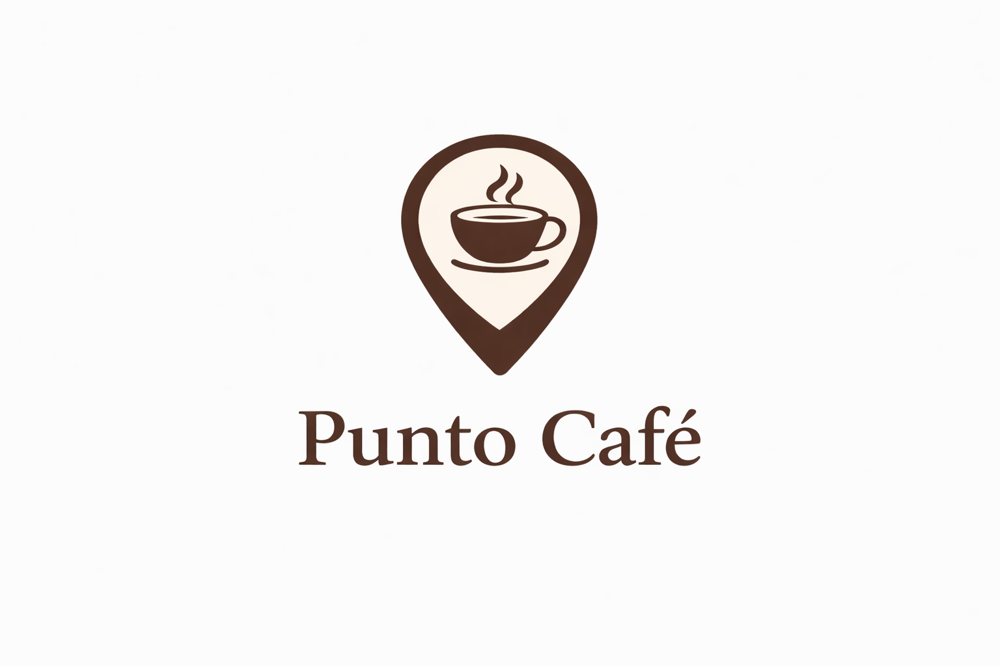 

Miembros y nombre del equipo:
 * :bust_in_silhouette:  Juan Carlos Vílchez Sánchez.
 GitHub: https://github.com/CarlosLinero9  :octocat:     
 * :bust_in_silhouette:  Iván García Hernández
 GitHub: https://github.com/ivaangh :octocat:

----- 

 

# Proceso de Diseño 

 

## Paso 1. UX User & Desk Research & Analisis 

### 1.a User Reseach Plan
 
-----
Se ha seleccionado la página web de la cafetería "Despiertoo Speciality Coffee" para la realización del análisis. Hablamos de una de las mejores cafeterías de especialidad de España. Situada en Granada.

A pesar de que no tenemos un gusto muy refinado para el café, podemos acercarnos a este tipo de mercado/negocio a través del conocimiento de otras ramas del panorama gastronómico y las posibles similitudes que puedan presentar con el caso estudiado.

El principal objetivo de este análisis es aportar una experiencia óptima a cualquier consumidor del servicio, contribuyendo a la visibilidad del negocio y consecuentemente al aumento de ventas.

<!-- VERSIÓN CORREGIDA -->
Para llevar a cabo este proyecto, planteamos una investigación de usuarios con un enfoque principalmente cualitativo, pues nos interesa centrarnos en entender los comportamientos, las motivaciones y las posibles frustraciones que los consumidores de café, tanto expertos como inexpertos, puedan experimentar al decidir probar una cafetería con café de especialidad. 

Por el motivo anterior y debido a la dificultad de encontrar perfiles reales que puedan ayudarnos a explorar correctamente esta experiencia, vamos a trabajar con personas imaginarias basadas en características reales que puedan darse en locales de este tipo, como es el caso de Despiertoo. Optaremos por explorar dos extremos, un caso de una persona que no entienda de cafés de especialidad y que tan solo busque una experiencia nueva y buen ambiente en el lugar físico; y otro caso será el de una persona experta que busque disfrutar, teniendo ya conocimientos del tema, del café de especialidad, optando por el uso de la página web que ofrece para comprar los productos. En uno de estos casos, trataremos también de estudiar la viabilidad del sitio para una persona con cierto grado de discapacidad visual, para ampliar nuestro enfoque y ver cómo llevar esta experiencia a todo el público, haciéndola lo más cómoda posible.

De esta manera, podremos explorar las distintas experiencias, tanto a nivel de cafetería física como de tienda online, que dos usuarios (que podrían ser perfectamente reales) puedan vivir en este caso.

<!-- VERSIÓN ERRÓNEA -->
<!-- Para llevar a cabo este proyecto, realizamos una serie de comparativas con distintas cafeterías de especialidad tanto de España como del resto del mundo. Plantearemos además varios perfiles ficticios de posibles consumidores con el fin de estudiar como podemos atraer a estos a través de las fortalezas/virtudes de nuestro proyecto. Una vez planteado el público objetivo, trazamos un jouney map que permita ayudarnos a mejorar la experiencia de los usuarios al interactuar con el proyecto.
Para finalizar, buscamos identificar los problemas de usabilidad a través del usability review. -->

<!-- cualitativo o cuantitativo, necesitamos personas reales o basta con imaginarias y cosas que necesitemos para hacer todo este análisis -->

Aquí el documento UserResearchPlan: [Abrir PDF](./P1/1-UseResearchPlan/User_Research_Plan.pdf)

### 1.b Competitive Analysis
 
-----

Con la finalidad de llegar al mayor número de clientes posibles, llevamos a cabo una comparativa con dos tipos de cafeterías:

  - "Perspectives Cafe". Se trata de una cafetería situada en Calle Elvira, en Granada. Ofrece una gran variedad de productos. Desde cafés e infusiones hasta tostadas y bollería. URL: 'https://www.perspectives.cafe/es/'

  - "Coffee 1931". Hablamos de una tienda especializada en la preparación y venta de café de especialidad. Cuentan con una tienda online. URL: 'https://www.coffee1931.com/'

El fin de esta comparativa es dar el negocio a conocer tanto a un público más general como a uno  más específico a través del análisis comparativo de las ventajas y desventajas de ambas propuestas. 

<!--Echar un vistazo a esto-->
El objetivo de esta comparativa es entender qué elementos ayudan a comunicar el negocio a un público amplio (información práctica visible, oferta clara y navegación sencilla) y cuáles refuerzan el atractivo para un público más específico (detalle del producto, contenido, confianza y compra online). En general, la opción más “generalista” destaca por facilitar decisiones rápidas y reducir fricción en tareas básicas, mientras que la opción especializada aporta profundidad de información, sensación de calidad y canales de conversión adicionales. Como conclusión, buscamos combinar ambos enfoques: claridad inmediata para quien decide en segundos y, al mismo tiempo, herramientas y contenido que soporten la exploración y la compra online para usuarios más interesados.

Repasamos las principales ventajas de cada una de estas propuestas, valorando el potencial que pueden aportar al objetivo de este proyecto. Para ello, comparamos las 3 webs valorando de 0 a 3 estrellas los siguientes criterios:

<!-- Echar un ojo -->
### Criterios usados en el Competitive Analysis

Para comparar el caso principal con los competidores hemos utilizado criterios agrupados en cuatro bloques: **modelo de negocio**, **aspectos tecnológicos**, **funcionalidad y tareas clave**, y **usabilidad/experiencia**.

#### Business Model
- **Oferta y propuesta de valor:** evaluamos si la web comunica con claridad qué ofrece el negocio (producto/servicio principal) y qué lo diferencia.
- **Canales de venta (local + online):** valoramos si integra bien la experiencia presencial con canales digitales (tienda online, reservas, información de local, etc.).
- **Estrategia de captación (newsletter/CTA):** revisamos si existen llamadas a la acción claras (seguir en redes, suscripción, reserva, compra) y si están bien situadas.

#### Technological Issues
- **Rendimiento y carga en móvil:** comprobamos rapidez percibida y fluidez en navegación móvil, evitando esperas y páginas pesadas.
- **Confianza legal y privacidad:** verificamos la visibilidad de aviso legal, política de privacidad/cookies y, si hay compra online, señales de pago seguro y condiciones claras.
- **Soporte de idioma (ES/EN):** valoramos si permite cambiar de idioma y si la traducción es consistente en secciones importantes.

#### Functionality & Use
- **Info práctica (horarios/ubicación):** evaluamos si el usuario encuentra fácilmente dirección, horarios, contacto y acceso a mapa/ruta.
- **Exploración del catálogo (categorías/buscador):** revisamos si es sencillo localizar productos o contenidos mediante categorías, buscador y/o filtros/ordenación.
- **Compra online y checkout:** comprobamos si el flujo de compra es claro (añadir al carrito, revisar pedido, pago) y si minimiza fricción.

#### Usability
- **Claridad y escaneabilidad:** valoramos jerarquía visual, legibilidad y que la información clave se encuentre rápido sin exceso de scroll.
- **Feedback de acciones (carrito/confirmaciones):** revisamos si el sistema confirma acciones importantes (añadir al carrito, envío de formularios, compra) y evita incertidumbre.
- **Experiencia y ambiente (storytelling/fotos):** analizamos si la web transmite el estilo del lugar y la experiencia mediante fotos, tono y contenido coherente.

<!--Falta meter el competitive analysis con FIGMA-->
Aquí el documento CompetitiveAnalysis: [Abrir PDF](./P1/2-CompetitiveAnalysis/CompetitiveAnalysis.pdf)

[Ver Competitive Analysis](./P1/2-CompetitiveAnalysis/CompetitiveAnalysis.jpg)

### 1.c Personas
 
-----

Para esta práctica hemos definido dos perfiles distintos, con necesidades y objetivos diferentes. Por un lado, tenemos a Álvaro, un técnico de sonido freelance de 32 años que busca un lugar cercano donde hacer una pausa entre trabajos sin perder tiempo, encontrando rápido la información clave antes de decidir. Por otro lado, Inés es una estudiante de 22 años que quiere desconectar del estrés de la universidad y quedar con amigas en un sitio agradable y cómodo, con la seguridad de saber qué se va a encontrar antes de ir.

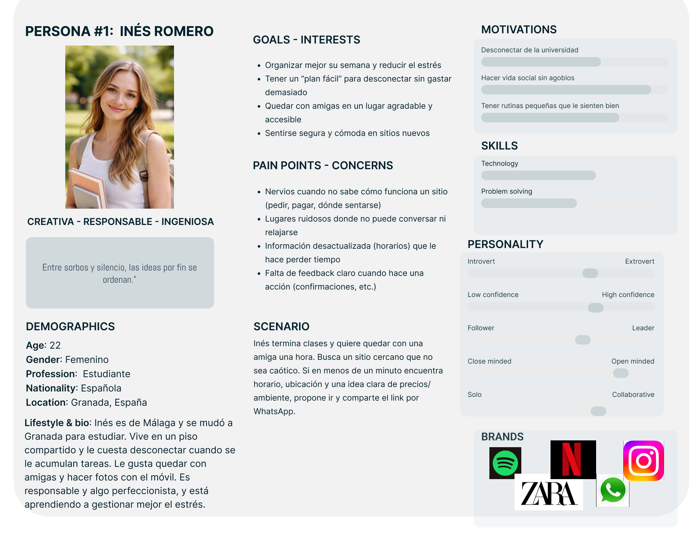 
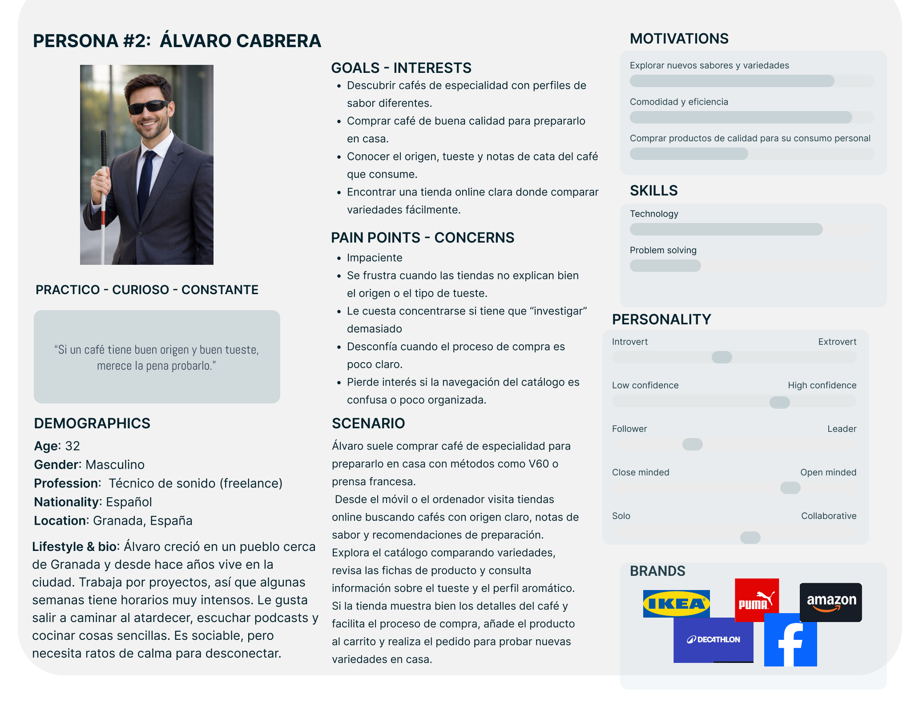

### 1.d User Journey Map
 
----
Hemos elegido estos dos casos de estudio para evaluar la experiencia de usuario en dos tareas muy habituales relacionadas con la cafetería: encontrar rápidamente la información esencial para decidir ir (horario, ubicación y carta/precios) y planificar una visita para quedar y pasar un rato sin sorpresas (ambiente y opciones disponibles). Queríamos reflejar también las fricciones que aparecen cuando la información no está bien organizada o es difícil de localizar desde el móvil. Lo más destacable es que, si los datos clave no son visibles a primera vista, el usuario pierde tiempo navegando y aumenta la incertidumbre: Álvaro abandona rápido si no puede decidir en segundos, e Inés se siente insegura si no puede confirmar fácilmente horarios, precios y “qué esperar” antes de ir.

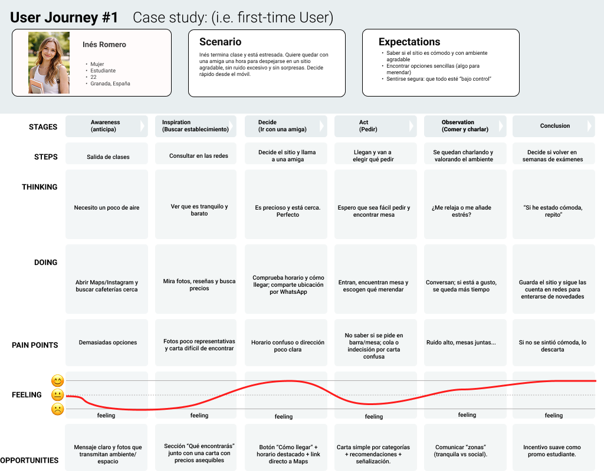 
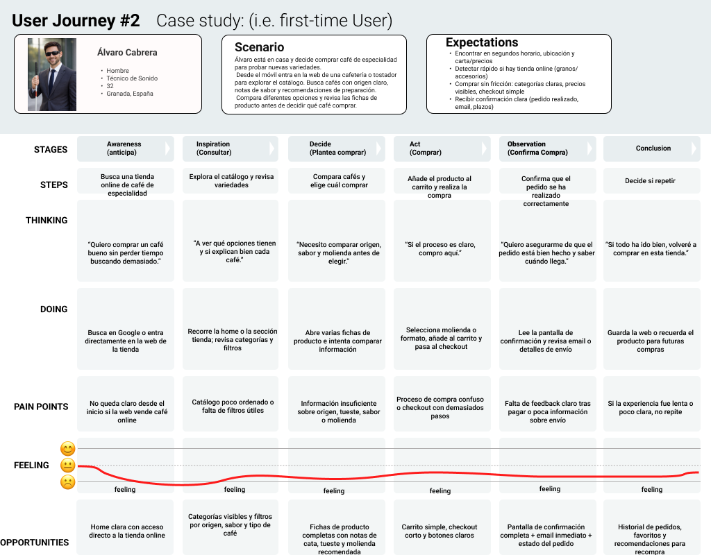 

### 1.e Usability Review
 
----
**Valoración numérica obtenida:** 74 – *Good*

**Comentario sobre la revisión:**  
La puntuación nos parece coherente porque, en general, el sitio permite completar las tareas principales con relativa facilidad (consultar información práctica del local y acceder a la tienda online). Destaca que la **ubicación/horarios y el contacto** están bastante accesibles y que existen **secciones legales** visibles, lo que aporta confianza. Como puntos mejorables, se nota la falta de un **buscador/filtros más potentes** en la tienda, y también que la web es bastante visual, lo que puede requerir más *scroll* y hacer menos “rápida” la búsqueda de información en móvil. Además, sería recomendable reforzar la **ayuda contextual** (FAQ, guía de compra/molienda/envíos) y el **feedback** en acciones clave de compra para reducir incertidumbre.

Aquí el documento UsabilityReview: [Abrir PDF](./P1/5-UsabilityReview/UsabilityReview.pdf)

### 1.f Briefing Final
Como se planteó en el *Research Plan*, el objetivo de esta práctica ha sido analizar la UX de **Despiertoo Speciality Coffee** para mejorar la experiencia de usuario y aumentar su visibilidad entre un público más joven, especialmente en móvil.

Para ello, comenzamos con un análisis comparativo frente a dos alternativas con enfoques distintos: **Perspectives** (orientada a atraer público general con una comunicación clara del local y su ambiente) y **Coffee 1931** (más centrada en el producto y la venta online, con una estructura de tienda más completa). Este contraste nos permitió identificar buenas prácticas para dos necesidades: la decisión rápida de visita (información práctica a primera vista) y la exploración/compra online (categorías, buscador y confianza en el *checkout*).

Después, evaluamos la experiencia desde dos perfiles: **Álvaro**, que decide con prisa y abandona si no encuentra en segundos horario, ubicación o carta, o si la compra online genera dudas; e **Inés**, que prioriza seguridad y claridad para quedar sin sorpresas.

Finalmente, la revisión de usabilidad (**74 – Good**) confirma que el sitio funciona bien en lo esencial (contacto, horarios, confianza legal), pero es mejorable en la exploración de la tienda (falta de buscador/filtros), la escaneabilidad en móvil (exceso de *scroll*) y el *feedback*/ayuda contextual (guías rápidas, confirmaciones y preguntas frecuentes).

Como conclusión, el sistema tiene una base sólida y potencial, pero debería reforzar el acceso inmediato a la información clave, mejorar la navegación del catálogo y simplificar/clarificar el proceso de compra para reducir incertidumbre y aumentar conversión.

Aquí el documento BriefingFinal: [Ver Briefing Final](./P1/6-BriefingFinal/BriefingFinal.pdf)
 

## Paso 2. UX Design  

### 2.a Reframing / IDEACION: Feedback Capture Grid / EMpathy map 
 
----    

Como conclusión de la práctica anterior, hemos sintetizado los principales hallazgos mediante un Feedback Capture Grid, con el objetivo de reformular el problema de diseño a partir del análisis competitivo, las personas, los journey maps y la usability review. En nuestro caso, el estudio muestra que la experiencia actual tiene una base sólida, pero todavía presenta fricciones en tareas clave, especialmente en móvil: encontrar rápidamente la información esencial del local, explorar la tienda con claridad, ofrecer información detallada sobre las distintas especialidades de café y comprar con confianza.

Tras comparar distintas referencias, observamos que la competencia suele resolver mejor unas necesidades que otras: algunas propuestas facilitan la decisión rápida de visita gracias a una comunicación más inmediata del local, mientras que otras destacan en la profundidad del catálogo y la compra online. Sin embargo, detectamos que sigue faltando una experiencia que una de forma clara estas dos dimensiones: información práctica visible + exploración guiada del café + apoyo al usuario menos experto, todo ello con una navegación eficiente y orientada a móvil.

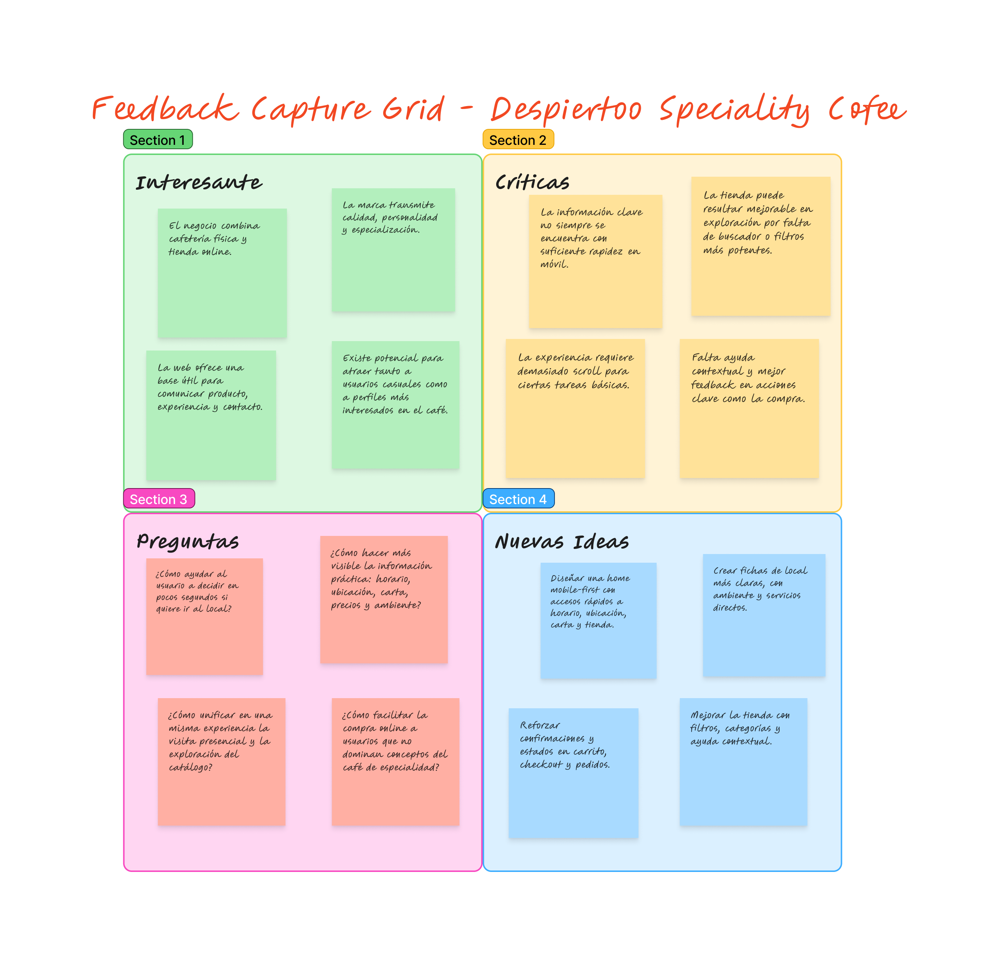 

#### Problema e Hipótesis
La experiencia digital actual comunica bien la identidad de la cafetería, pero no facilita de forma suficientemente rápida y clara las dos tareas principales del usuario: decidir una visita al local y explorar/comprar café online con seguridad y garantizando una decisión informada, especialmente desde el móvil. Cuando la información práctica no aparece de inmediato o la tienda exige demasiado esfuerzo de exploración, aumenta la incertidumbre y disminuyen la confianza del usuario y la eficiencia de uso.

Nuestra hipótesis de diseño plantea que, si desarrollamos una experiencia mobile-first que priorice desde la primera pantalla la información práctica del local —como horario, ubicación, carta y ambiente— y que además simplifique la exploración del catálogo mediante filtros, ayuda contextual, más detalles de cada producto (para los más expertos) y mejor feedback en las acciones de compra, los usuarios podrán tomar decisiones más rápidas, comprender mejor la oferta y completar sus objetivos con mayor confianza y menos fricción. A partir de esta idea, la propuesta de valor de nuestro nuevo diseño consiste en crear una plataforma digital para una cafetería de especialidad que integre en una sola experiencia la decisión rápida de visita al local y la compra guiada de café, ofreciendo una navegación clara, útil y accesible tanto para usuarios expertos como para quienes se están iniciando en este tipo de producto.

Aquí el FeedBackCaptureGrid: [FeedBack Capture Grid](./P2/1-FeedBackCaptureGrid/FeedBackCaptureGrid.pdf)

### 2.b ScopeCanvas

----

Nuestra propuesta de valor consiste en diseñar una experiencia digital para una cafetería de especialidad que permita a los usuarios resolver de forma rápida y clara sus dos necesidades principales: decidir si quieren visitar el local y explorar/comprar café online con confianza.

Para ello, proponemos una plataforma mobile-first que reúna en una sola experiencia la información práctica del establecimiento —horario, ubicación, carta, precios y ambiente— junto con una tienda mejor organizada, con filtros, ayuda contextual y recomendaciones para usuarios expertos y principiantes.

De este modo, el nuevo diseño no solo mejora la rapidez de acceso a la información, sino que también reduce la incertidumbre durante la navegación y facilita la conversión tanto en visita presencial como en compra digital.

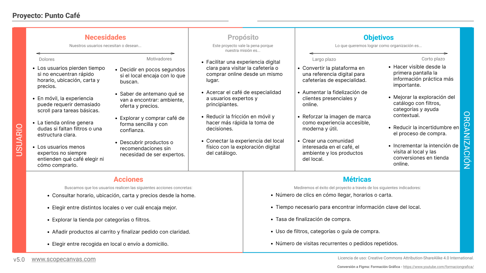 

### 2.b User Flow (task) analysis 
 
-----

Hemos definido dos user flows principales a partir de las tareas más relevantes detectadas en la práctica 1. El primero representa el recorrido del usuario que necesita decidir rápidamente si visitar la cafetería, consultando información esencial como horario, ubicación, carta, precios y ambiente. El segundo muestra el flujo de exploración y compra de café online, incluyendo búsqueda o filtrado de productos, consulta de ayuda contextual y proceso de compra. Ambos flujos están orientados a reducir la incertidumbre, mejorar la navegación móvil y facilitar las acciones clave del usuario.

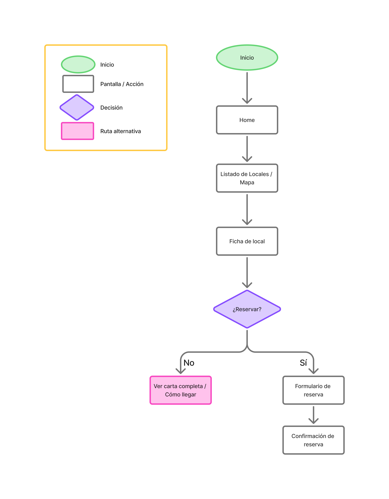

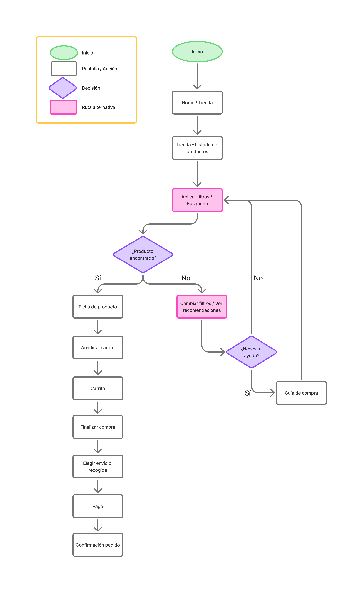

Para consultar el pdf de los User Flow:
[UserFlow1](./P2/3-UserFlows/UserFlows1.pdf)
[UserFlow2](./P2/3-UserFlows/UserFlows2.pdf)

#### User Task Matrix
Hemos valorado las tareas según la prioridad o relevancia para los distintos tipos de usuario, tomando como referencia los dos flujos principales del sistema: **explorar locales y realizar una reserva** y **buscar/comprar productos en la tienda online**.

Las categorías empleadas son:

- **Alta**: tarea principal para ese tipo de usuario.
- **Media**: tarea secundaria o de apoyo.
- **Baja**: tarea ocasional o poco frecuente.
- **-**: no tiene acceso a esa funcionalidad.

| Tarea | Usuarios no registrados | Usuarios registrados | Administrador |
|-------|--------------------------|----------------------|---------------|
| Iniciar sesión | Media | Alta | Alta |
| Cerrar sesión | - | Media | Alta |
| Registrarse | Alta | - | - |
| Explorar locales / mapa | Alta | Alta | Media |
| Ver ficha del local | Alta | Alta | Media |
| Ver carta completa | Alta | Alta | Media |
| Ver cómo llegar | Alta | Alta | Media |
| Reservar mesa | Media | Alta | Media |
| Rellenar formulario de reserva | Media | Alta | Baja |
| Ver confirmación de reserva | Media | Alta | Baja |
| Acceder a la tienda | Alta | Alta | Media |
| Buscar producto | Alta | Alta | Media |
| Aplicar filtros | Alta | Alta | Media |
| Cambiar filtros / ver recomendaciones | Media | Media | Baja |
| Ver ficha de producto | Alta | Alta | Media |
| Consultar guía de compra | Media | Media | Baja |
| Añadir al carrito | Media | Alta | Baja |
| Ir al carrito | Media | Alta | Baja |
| Finalizar compra | Baja | Alta | Baja |
| Elegir envío o recogida | Baja | Alta | Baja |
| Realizar pago | Baja | Alta | Baja |
| Ver confirmación de pedido | Baja | Alta | Baja |
| Editar perfil | - | Alta | Alta |
| Ver historial de pedidos | - | Alta | Alta |
| Gestionar productos | - | - | Alta |
| Gestionar pedidos | - | - | Alta |
| Gestionar reservas | - | - | Alta |
| Actualizar locales / horarios / carta | - | - | Alta |
 

### 2.c IA: Sitemap + Labelling 
 
----

#### Sitemap
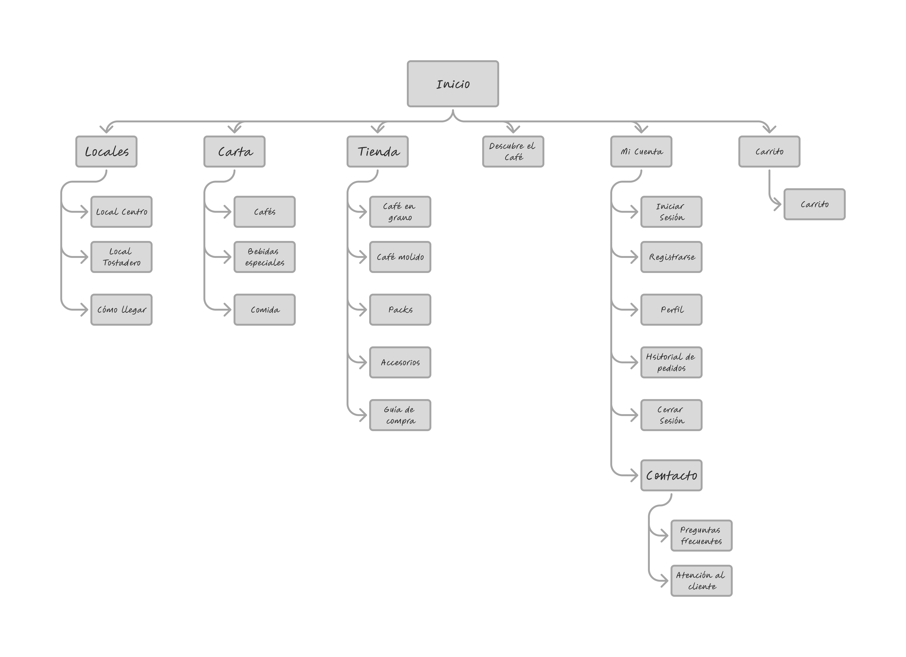
 Consulta el sitemap aquí: [Sitemap](./P2/4-Sitemap/Sitemap.pdf)

#### Labelling

| Término | Icono | Significado |
|-------------------|----------------|--------------|
| Inicio | 🏠 | Volver al punto de entrada |
| Locales | 📍 | Buscar información del local |
| Cómo llegar | 🗺️ | Abrir mapa y ruta |
| Carta | ☕ | Consultar oferta del local |
| Cafés | ☕ | Ver tipos de café |
| Bebidas especiales | 🧋 | Ver bebidas de autor |
| Comida | 🥐 | Ver comida disponible |
| Precios | 💶 | Consultar precios |
| Tienda | 🛍️ | Comprar productos online |
| Café en grano | 🌰 | Ver café sin moler |
| Café molido | 🫘 | Ver café molido |
| Packs | 🎁 | Ver lotes/ofertas |
| Accesorios | 🧰 | Ver complementos |
| Guía de compra | 📖 | Ayuda para elegir |
| Descubre el café | 🔎 | Explorar contenido educativo |
| Métodos de preparación | ⚙️ | Cómo preparar café |
| Tipos de molienda | 🌀 | Elegir molienda adecuada |
| Orígenes y sabores | 🌍 | Conocer origen y notas |
| Mi cuenta | 👤 | Gestión de usuario |
| Iniciar sesión | 🔐 | Acceder a cuenta |
| Registrarse | ✍️ | Crear cuenta |
| Perfil | 🪪 | Editar datos |
| Historial de pedidos | 📦 | Ver pedidos anteriores |
| Cerrar sesión | 🚪 | Salir de la cuenta |
| Carrito | 🛒 | Revisar compra |
| Contacto | ✉️ | Soporte / comunicación |
| Preguntas frecuentes | ❓ | Resolver dudas |
| Atención al cliente | 🎧 | Contactar con soporte |

La arquitectura de la información se ha estructurado diferenciando claramente la experiencia presencial (Locales y Carta) de la experiencia de compra online (Tienda y Carrito), incorporando además una sección de apoyo (“Descubre el café”) para reducir la incertidumbre de usuarios principiantes.

En el labelling se han evitado anglicismos como “Login” o “Checkout”, optando por términos claros en castellano que faciliten la comprensión y coherencia del sistema.

### 2.d Wireframes
 
-----

Como parte del proceso de diseño de la interfaz, se desarrollaron varios wireframes en baja fidelidad (Lo-Fi) con el objetivo de definir la estructura básica de las pantallas principales de la aplicación web. Estos esquemas permiten organizar la información, establecer la jerarquía visual de los elementos y comprobar la lógica de navegación antes de entrar en decisiones más detalladas relacionadas con el estilo gráfico o la estética final.

En una primera fase, las ideas se plantearon de forma esquemática a partir de bocetos previos, centrándose en la disposición de los contenidos y en la funcionalidad de cada pantalla. Posteriormente, estos planteamientos se trasladaron a Figma, donde se construyeron versiones más ordenadas y consistentes, manteniendo un enfoque simple y funcional propio de los wireframes. De este modo, fue posible trabajar con una propuesta clara, homogénea y fácil de iterar.

Los wireframes recogen las pantallas principales de la aplicación, incluyendo la página de inicio, la tienda con su sistema de filtros, la ficha de producto, el carrito, el área de cuenta personal, la gestión de pedidos, direcciones y métodos de pago. También se contemplan secciones informativas como la presentación de la marca, la carta y los locales. En conjunto, estas vistas se han planteado para ofrecer una navegación clara e intuitiva, organizar la información de forma comprensible y dar respuesta a las necesidades del usuario detectadas durante las fases previas de análisis.

#### Bocetos
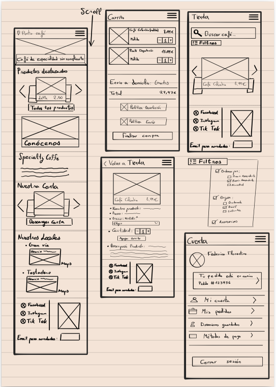
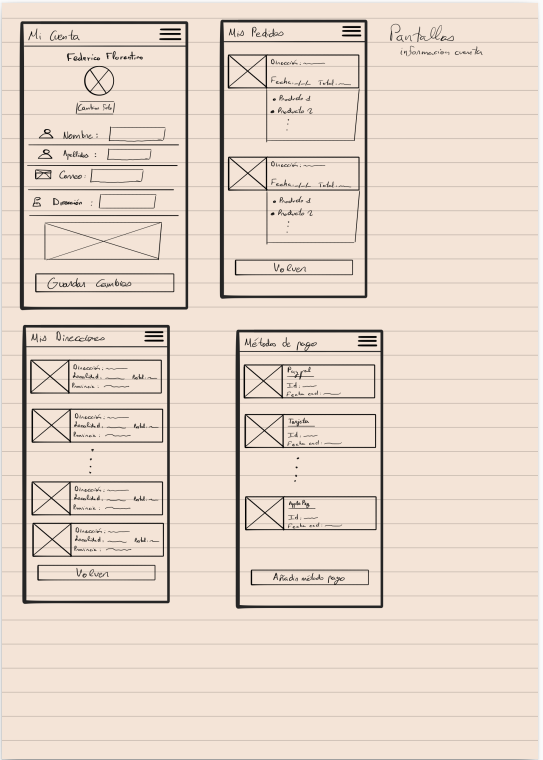

[Boceto (PDF)](./P2/5-Wireframe/bocetos/pdf/boceto.pdf)

#### Pantalla Principal
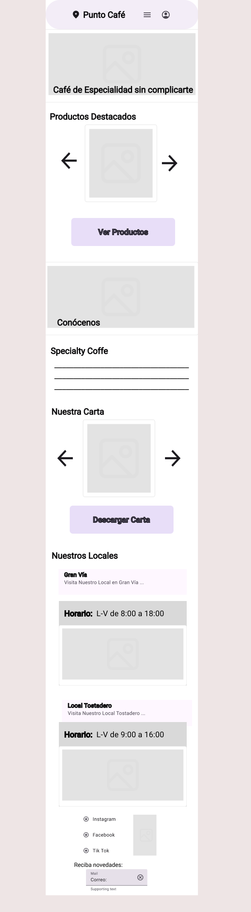

#### Información de un café
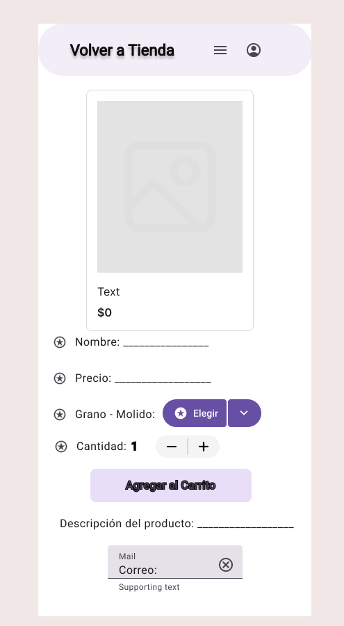

#### Tienda y carrito
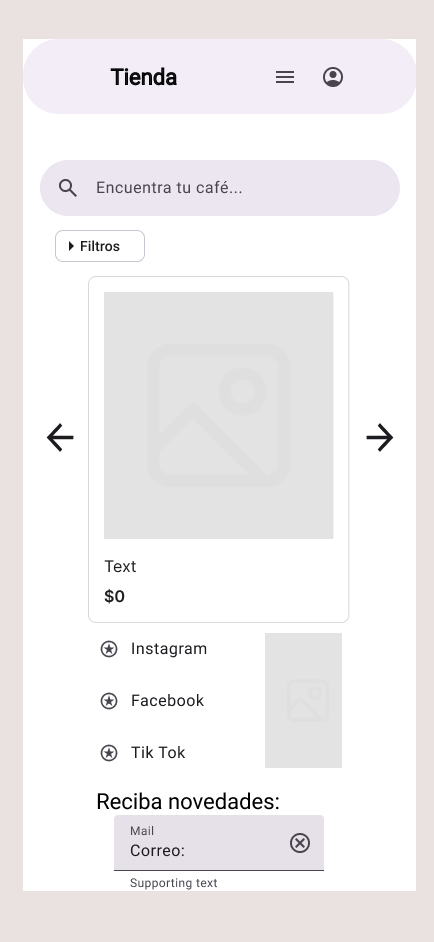
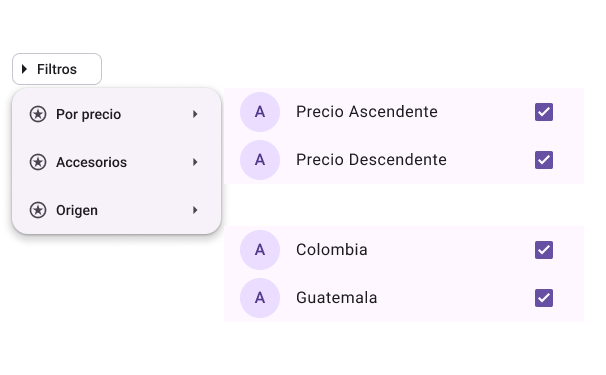
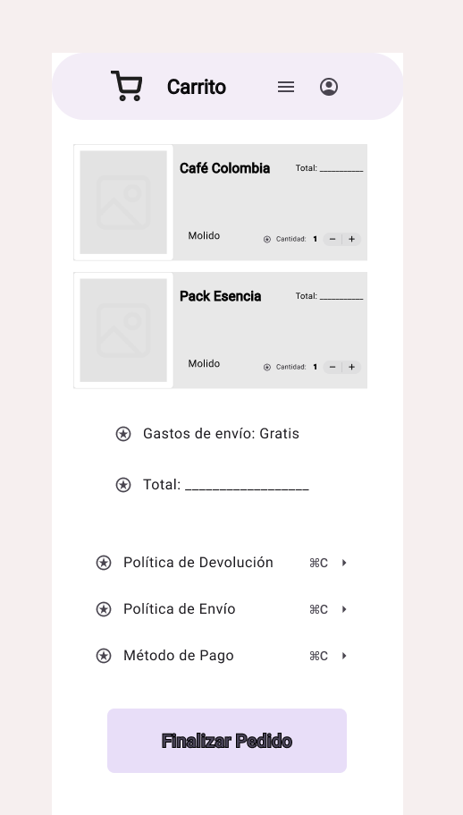

#### Perfil
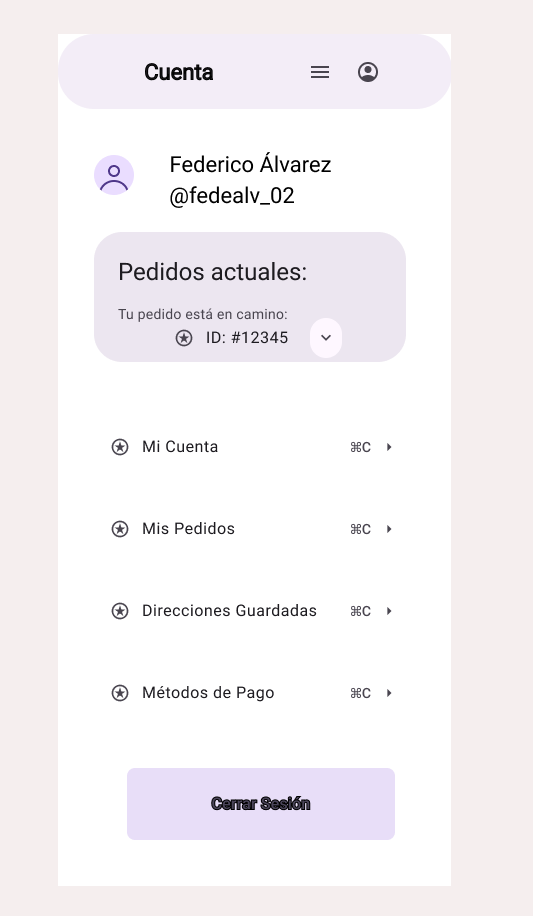
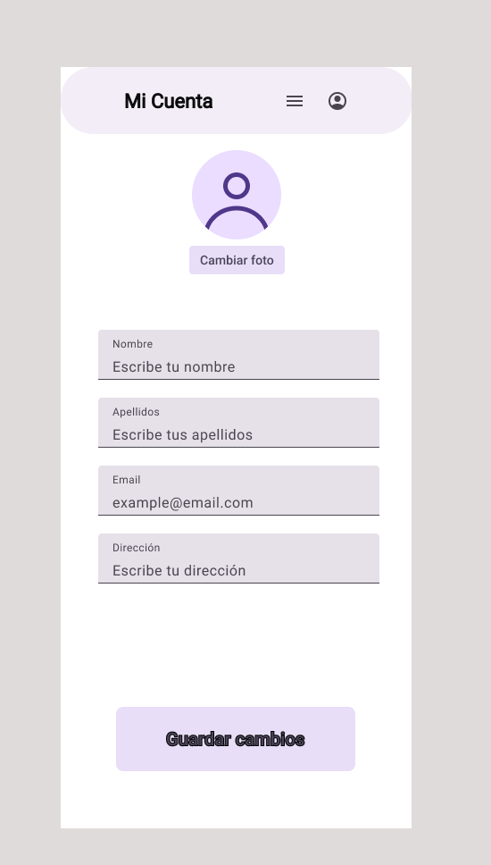
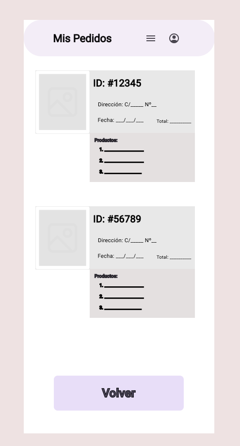
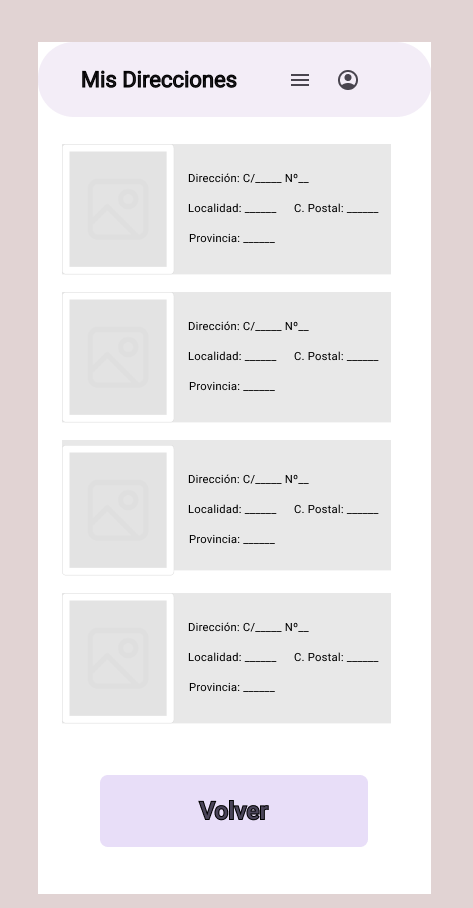
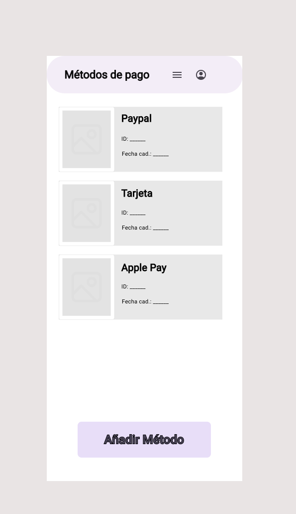

[Wireframe (PNG)](./P2/5-Wireframe/wireframe/WireFrame.png)

 

## Paso 3. Mi UX-Case Study (diseño)

### 3.a Moodboard

-----

#### Moodboard:
 

#### Logos:

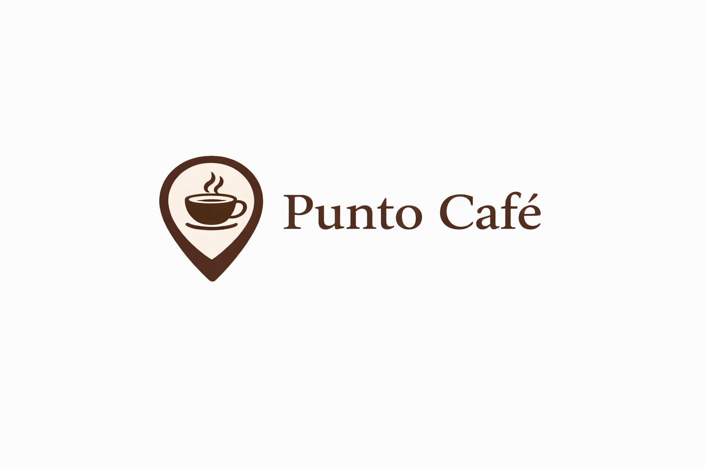
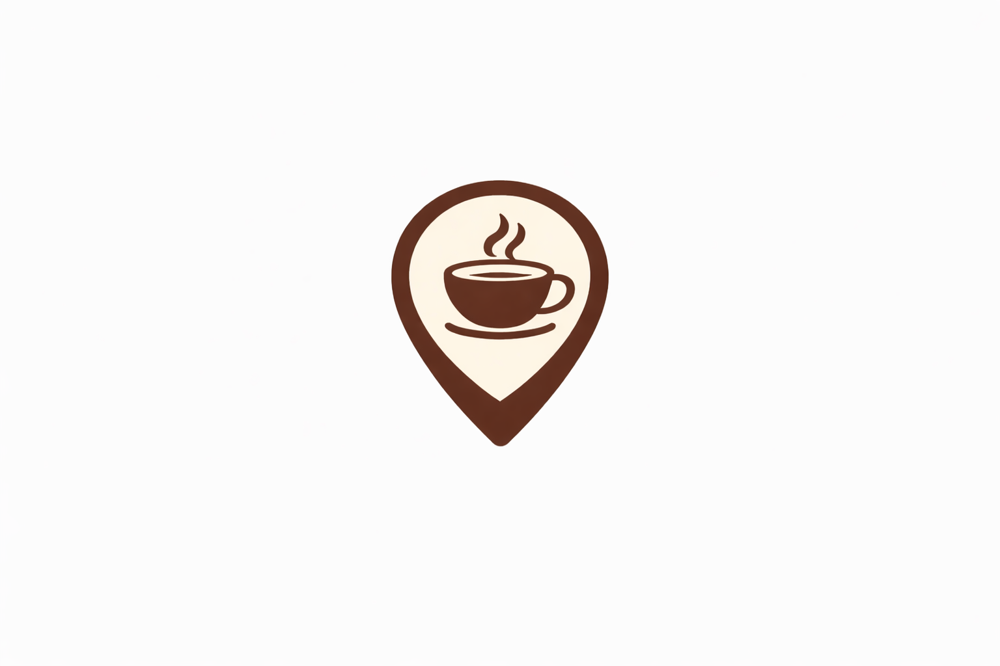

Para la elaboración del moodboard se ha utilizado Figma/FigJam, ya que permite organizar de forma visual la paleta, tipografías, logotipo e imágenes de referencia en un mismo espacio de trabajo.

El logotipo sí puede reutilizarse en redes sociales como Instagram, por ejemplo en la imagen de perfil o en publicaciones, siempre que se exporte en un formato y tamaño apropiados.

### 3.b Landing Page
 
----

### 3.c Guidelines
 
----

En esta fase se han definido una serie de **guidelines de interfaz** a partir de los wireframes y mockups desarrollados para **Punto Café**, con el objetivo de mantener una experiencia visual coherente, sencilla y centrada en las tareas principales detectadas en fases anteriores: **descubrir locales**, **consultar información útil del establecimiento** y **comprar productos online** de forma clara y guiada.

A partir de los diseños realizados, se han consolidado los siguientes patrones de interfaz:

- **Barra superior unificada**: todas las pantallas comparten un encabezado redondeado y limpio, que integra la identidad de marca y accesos rápidos como menú y perfil. Esto aporta consistencia y facilita la orientación del usuario.

- **Jerarquía vertical simple**: la información se organiza en bloques claramente diferenciados, priorizando una lectura de arriba abajo muy adecuada para móvil. De este modo, cada pantalla presenta primero la información o acción más importante y después el contenido complementario.

- **Tarjetas de contenido (cards)**: se utilizan para representar productos, locales, pedidos, direcciones y métodos de pago. Este patrón permite agrupar información relacionada en módulos visuales fáciles de escanear y reutilizables en distintas secciones.

- **Botones principales destacados**: acciones clave como **Ver productos**, **Agregar al carrito**, **Finalizar pedido**, **Guardar cambios** o **Volver** se resuelven mediante botones grandes, centrados y con un color lavanda suave que los hace visibles sin romper la armonía general de la interfaz.

- **Exploración guiada en tienda**: la tienda incorpora un buscador visible y un sistema de filtros desplegables, lo que ayuda a reducir el esfuerzo de búsqueda y mejora la exploración de productos según criterios como precio, accesorios u origen.

- **Fichas de producto centradas en la decisión**: en la vista de detalle del producto se priorizan nombre, precio, tipo de molienda, cantidad y CTA de compra. Esta estructura responde directamente al flujo de compra definido en los User Task Flows.

- **Carrito con resumen claro**: la pantalla de carrito muestra los productos añadidos, la cantidad, el subtotal y accesos a información complementaria como política de devolución, envío y método de pago. Así se reduce incertidumbre antes de finalizar el pedido.

- **Área de cuenta modular**: la sección de usuario se divide en bloques funcionales como **Mi cuenta**, **Mis pedidos**, **Direcciones guardadas** y **Métodos de pago**, facilitando una navegación clara dentro del perfil y manteniendo una estructura coherente con el resto del sistema.

- **Pantallas de gestión específicas**: vistas como direcciones, pedidos o métodos de pago reutilizan la misma lógica visual basada en tarjetas, encabezado fijo y una acción principal al final, reforzando la consistencia del sistema.

- **Uso de espacios amplios y baja densidad visual**: se ha optado por una interfaz despejada, con bastante aire entre elementos, para favorecer la legibilidad y la comodidad de uso en dispositivos móviles.

- **Paleta visual suave y funcional**: los tonos lilas y neutros empleados en botones, fondos y bloques ayudan a transmitir una experiencia amable, moderna y accesible, sin competir con el contenido principal.

En conjunto, estas guidelines permiten construir una interfaz mobile-first coherente con la propuesta de valor de **Punto Café**: una experiencia clara, cercana y funcional que une en un mismo sistema la consulta de locales, la exploración de productos y la compra online guiada.

#### Pantallas principales del guideline

### Inicio
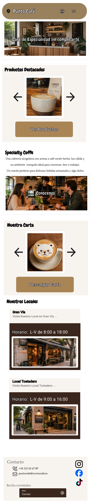

### Tienda y exploración de productos
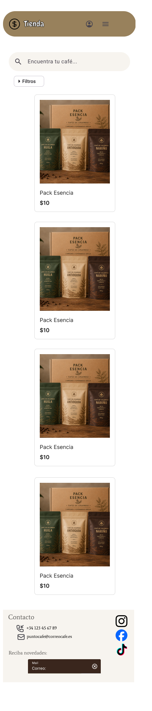

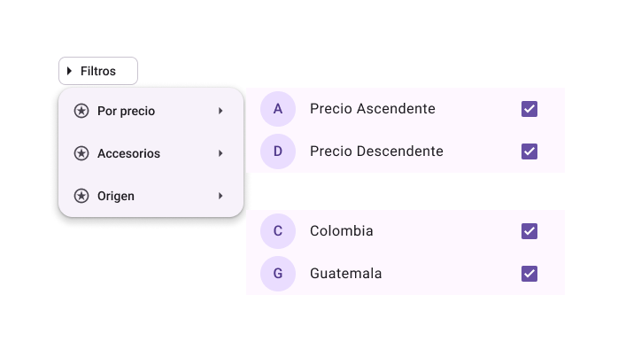

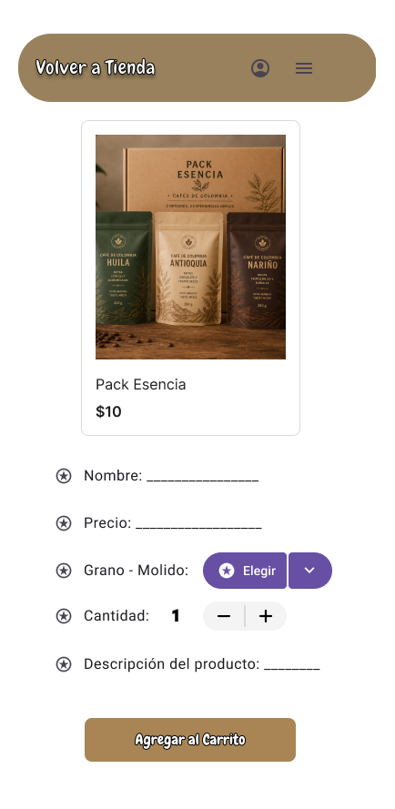

### Carrito y proceso de compra
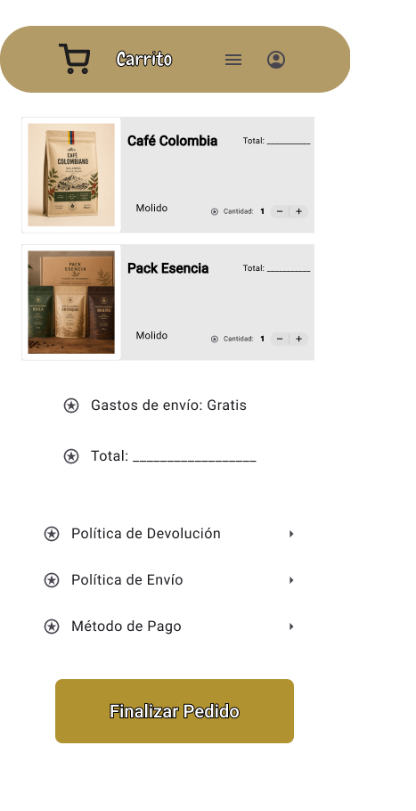

### Área de usuario
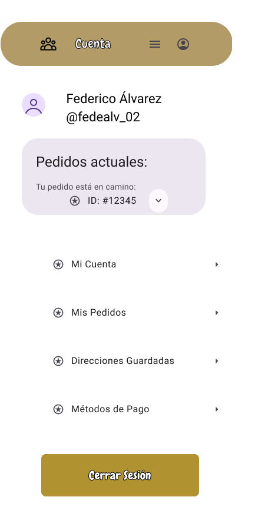

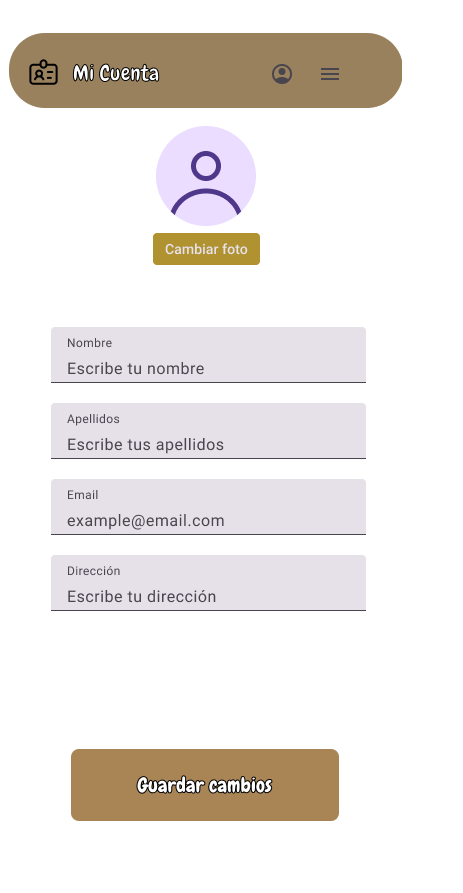

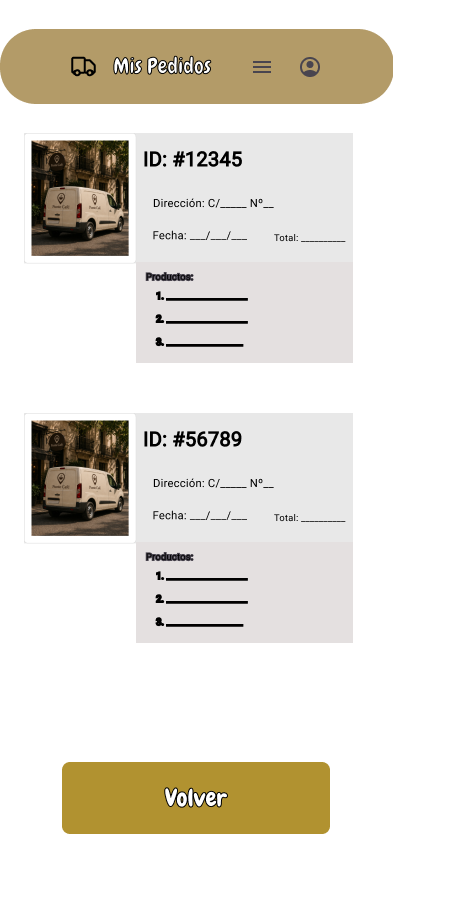

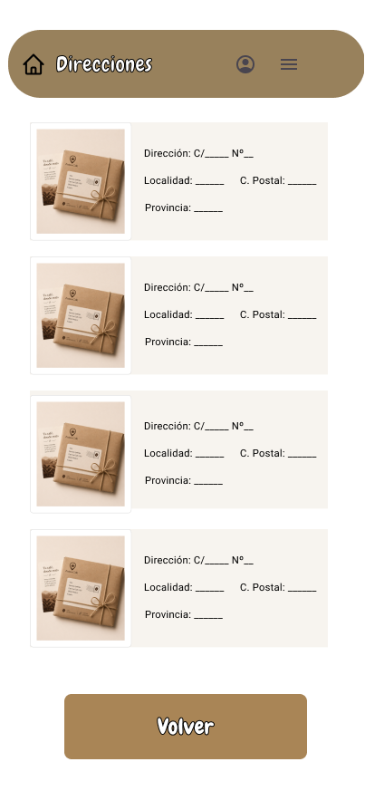

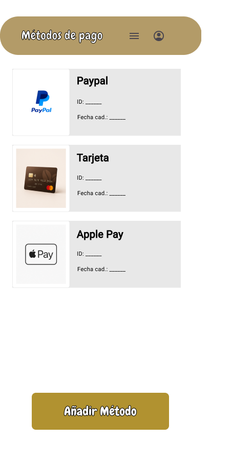

### 3.d Mockup
 
----

En esta fase se ha desarrollado una primera versión navegable de la propuesta mediante **wireframes interactivos en Figma**. El objetivo de estos wireframes ha sido definir la estructura general de **Punto Café**, organizar las pantallas principales del sistema y comprobar que los flujos de navegación responden de forma clara a las tareas detectadas en fases anteriores antes de continuar con el diseño visual definitivo.

A través del prototipo se pueden simular las acciones más importantes de la aplicación, como **explorar la tienda**, **buscar y filtrar productos**, **consultar la ficha de un café**, **añadir artículos al carrito**, **revisar el pedido** y acceder al área de **cuenta de usuario**, donde se incluyen apartados como **mis pedidos**, **direcciones guardadas** y **métodos de pago**. Además, el sistema incorpora una pantalla principal con acceso a productos destacados, carta y locales, así como vistas específicas para reforzar la comprensión del producto y la gestión de la compra. De este modo, los wireframes nos han permitido validar tanto la arquitectura de la información como la relación entre pantallas y tareas, de una forma sencilla, visual y coherente con el flujo general de uso. 

- **Enlace al wireframe interactivo en Figma:** [Ver wireframe interactivo](https://www.figma.com/proto/yWEqVgqky7uYk8etIc7p0s/WireFrame?node-id=82-1010&p=f&t=w87hcnswGLuCCPV2-0&scaling=scale-down&content-scaling=fixed&page-id=0%3A1&starting-point-node-id=82%3A1010)

### 3.e My UX-Case Study
 
-----

Consultar nuestro Case Study [aquí](https://github.com/CarlosLinero9/UX_CaseStudy/tree/main)

 

## Paso 4. Pruebas de Evaluación 

### 4.a Reclutamiento de usuarios 

-----

Para la evaluación se comparan dos casos:

- **Caso A:** Punto Café, nuestra propuesta de aplicación web para una cafetería de especialidad. Permite consultar productos, ver cafés, localizar tiendas y realizar un proceso de compra o reserva.
- **Caso B:** [Umai! 旨い](https://github.com/DeltaCeleste/Midas), caso asignado para la comparación A/B Testing. Se trata de una aplicación web para un restaurante japonés tematizado en la cultura y gastronomía de Japón.

Se han seleccionado 4 usuarios ficticios para realizar las pruebas, asignando 2 usuarios al Caso A y 2 usuarios al Caso B. Se busca que los perfiles sean variados en edad, experiencia tecnológica y forma de navegar, para poder detectar posibles problemas de comprensión, accesibilidad y usabilidad.

| Usuarios | Sexo/Edad | Ocupación | Exp.TIC | Personalidad | Plataforma | Caso |
| -------- | --------- | --------- | ------- | ------------- | ---------- | ---- |
| Laura | M / 21 | Estudiante universitaria | Alta | Visual y curiosa | Web | A |
| Antonio | H / 52 | Administrativo | Media | Práctico e impaciente | Móvil | A |
| Marta | M / 34 | Profesora | Media | Reflexiva y organizada | Web | B |
| Diego | H / 19 | Estudiante de grado | Alta | Impulsivo y rápido navegando | Móvil | B |

#### Posibles situaciones conflictivas

| Usuario | Posible situación conflictiva |
| ------- | ----------------------------- |
| Laura | Puede centrarse más en la estética de Punto Café que en completar la tarea de compra o búsqueda de producto. |
| Antonio | Puede tener dificultades si el proceso en Punto Café tiene demasiados pasos o si los botones en móvil no son claros. |
| Marta | Puede necesitar más información antes de decidir en Umai!, por ejemplo sobre carta, reservas o ubicación. |
| Diego | Puede navegar demasiado rápido por Umai! y saltarse instrucciones o información importante. |

### 4.b Diseño de las pruebas 
 
-----

La evaluación se organizará en torno a tres pruebas principales para poder comparar la experiencia de uso de ambos casos.

La primera prueba será un **A/B Testing**. En nuestro estudio, el **Caso A** corresponde a **Punto Café** y el **Caso B** corresponde al proyecto asignado **Umai! 旨い**. Con esta prueba se pretende comprobar si los usuarios consiguen completar una serie de objetivos similares en las dos interfaces. Para ello, se plantearán tareas equivalentes en ambos proyectos, como encontrar información relevante, consultar un producto o elemento de la carta y llegar al inicio de un proceso de compra o reserva.

Después de la interacción con las interfaces, se pasará el cuestionario **SUS** a los participantes. Este cuestionario permite recoger una valoración general de la facilidad de uso percibida mediante 10 afirmaciones puntuadas del 1 al 5. A partir de las respuestas se obtendrá una puntuación final que servirá para comparar la usabilidad percibida de cada caso.

Además, se realizará una prueba de **Eye Tracking** para analizar qué zonas de la pantalla atraen más la atención del usuario. Esta prueba ayudará a detectar si los elementos importantes son visibles, si hay zonas que pasan desapercibidas o si el usuario se distrae con elementos secundarios durante la navegación.

Por último, se utilizará el **checklist de la P1** como revisión previa. Este checklist servirá para comprobar aspectos básicos antes de las pruebas con usuarios, como la claridad de la navegación, la legibilidad de los textos, la visibilidad de los botones, el contraste, la jerarquía visual y la adaptación a distintos dispositivos.

### 4.c Cuestionario SUS
 
----

**Resultados**

En el **Caso A**, correspondiente a **Punto Café**, se ha obtenido una media de **81,3 puntos**, lo que sitúa el resultado dentro de la categoría **aceptable tipo B / excelente**. La valoración general es positiva, especialmente en la claridad visual, la facilidad para localizar productos y la sensación de seguridad durante la navegación. Aun así, el resultado de Antonio es algo más bajo que el de Laura, por lo que se puede observar que la experiencia podría mejorar en dispositivos móviles o para usuarios que prefieren procesos más directos.

En el **Caso B**, correspondiente a **Umai! 旨い**, la media obtenida ha sido de **75 puntos**, por lo que se considera un resultado **aceptable tipo C**. La interfaz supera el umbral de aceptación y resulta funcional para los usuarios, aunque las puntuaciones muestran que algunos elementos pueden generar más dudas. En especial, Marta ha obtenido una puntuación más ajustada, lo que indica que la navegación o la jerarquía de información podrían reforzarse para que las secciones importantes sean más fáciles de identificar.

Comparando ambos casos, **Punto Café obtiene una puntuación media superior**, por lo que los usuarios lo perciben como una interfaz algo más clara y sencilla. Sin embargo, ambos proyectos se mantienen dentro de un rango aceptable de usabilidad, por lo que las dos propuestas cumplen los objetivos básicos de la evaluación.

**Opiniones**

- Laura (caso A): "La web me ha resultado clara y agradable visualmente. He encontrado los productos sin dificultad."
- Antonio (caso A): "La página se entiende bien, aunque en móvil algunos pasos podrían estar más simplificados."
- Marta (caso B): "La interfaz es atractiva, pero en algunos momentos he dudado sobre dónde encontrar cierta información."
- Diego (caso B): "La página me parece fácil de usar y visualmente llamativa, aunque algunos elementos podrían destacar más."

**Enlace al pdf**: [SUS](P4/3.CuestionarioSUS/Cuestionario_SUS_PuntoCafe_Umai.pdf)

### 4.d A/B Testing
 
-----

Para la prueba A/B Testing se han comparado dos propuestas:

- **Caso A:** Punto Café, nuestra propuesta de aplicación web para una cafetería de especialidad.
- **Caso B:** Umai! 旨い, proyecto asignado para la comparación, centrado en un restaurante japonés.

En un primer momento se valoró utilizar Maze para obtener métricas automáticas de navegación, como duración media, tasa de éxito, abandonos o clics erróneos. Sin embargo, al no disponer de un prototipo navegable completo del Caso B, se decidió realizar la comparación de forma manual a partir de las pantallas y recursos disponibles de ambos proyectos.

La prueba se ha organizado en torno a tres tareas equivalentes para los dos casos. El objetivo es observar en cuál de las dos interfaces resulta más sencillo completar acciones básicas, como encontrar información, consultar productos o iniciar un proceso principal.

| Prueba | Caso A: Punto Café | Caso B: Umai! 旨い |
| ------ | ------------------ | ------------------ |
| **Tarea 1: localizar un producto o elemento de la carta** | Los usuarios identifican con facilidad la zona de productos. La sección de cafés resulta clara y el botón principal ayuda a avanzar. | La carta o contenido gastronómico se reconoce, aunque la estética y la cantidad de elementos visuales pueden hacer que el usuario tarde más en orientarse. |
| **Tarea 2: consultar información del local** | La información sobre tienda o punto de venta se encuentra de forma bastante directa. La navegación es sencilla y no requiere muchos pasos. | La información del restaurante puede localizarse, pero necesita una exploración algo mayor por parte del usuario. |
| **Tarea 3: iniciar una compra o reserva** | El flujo principal se entiende correctamente. Los botones de acción tienen buena visibilidad y el usuario puede avanzar sin demasiadas dudas. | La acción principal también está presente, aunque en algunos momentos puede quedar menos destacada frente al diseño visual general. |

<!--
#### Resultados obtenidos

| Métrica | Caso A: Punto Café | Caso B: Umai! 旨い |
| ------- | ------------------ | ------------------ |
| Tareas completadas | 6/6 | 5/6 |
| Pantalla objetivo alcanzada | 6/6 | 5/6 |
| Recorrido sin errores importantes | 5/6 | 4/6 |
| Dudas observadas | Bajas | Medias |
| Valoración general | Más directa y clara | Más visual, pero algo menos inmediata |

#### Resultado global

A partir de la comparación realizada, el **Caso A: Punto Café** se considera ligeramente más usable para las tareas planteadas. Los usuarios pueden identificar antes las acciones principales y completar los recorridos con menos dudas.

El **Caso B: Umai! 旨い** también presenta una propuesta funcional y atractiva, pero algunos elementos visuales pueden competir con la información principal, haciendo que ciertas acciones requieran más exploración.

Por tanto, el resultado agregado indica que **Punto Café es el caso más usable en esta prueba**, especialmente por la claridad de su navegación, la visibilidad de sus botones principales y la organización de la información.

>>> Los resultados de un A/B testing con 3 pruebas y 2 casos o alternativas daría como resultado una tabla de 3 filas y 2 columnas, además de un resultado agregado global. Especifique con claridad el resultado: qué caso es más usable, A o B?
-->
### 4.e Aplicación del método Eye Tracking 

----

>>> Indica cómo se diseña el experimento y se reclutan los usuarios. Explica la herramienta / uso de gazerecorder.com u otra similar. Aplíquese únicamente al caso B.

  
>>> Cambiar esta img por una de vuestro experimento. El recurso deberá estar subido a la carpeta P4/  

>>> gazerecorder en versión de pruebas puede estar limitada a 3 usuarios para generar mapa de calor (crédito > 0 para que funcione) 

### 4.f Usability Report de B
 
-----
<!--
Se ha elaborado un **Usability Report** del **Caso B**, correspondiente al proyecto **Umai! 旨い**, asignado a nuestro grupo para la evaluación comparativa de usabilidad. Este informe recoge los resultados obtenidos a partir de las distintas pruebas realizadas durante la práctica: reclutamiento de usuarios, A/B Testing, cuestionario SUS y análisis mediante Eye Tracking.

El objetivo de este informe es detectar las principales fortalezas y debilidades de la interfaz evaluada, prestando atención a aspectos como la claridad de navegación, la visibilidad de los elementos principales, la facilidad para completar tareas y la jerarquía visual de la información.

**Proyecto evaluado:** [Umai! 旨い - Grupo Midas](https://github.com/DeltaCeleste/Midas)  
**Equipo evaluador:** DIU2 - LecheConCafe  
**Caso comparado:** Punto Café  
**Caso evaluado en el informe:** Caso B - Umai! 旨い  

---

#### Descripción del Caso B

**Umai! 旨い** es una aplicación web centrada en un restaurante japonés tematizado en la cultura y gastronomía de Japón. La propuesta combina una estética visual muy marcada con secciones destinadas a consultar la carta, realizar reservas, acceder a la cuenta de usuario y descubrir elementos relacionados con distintas regiones japonesas.

A nivel visual, el proyecto presenta una identidad bastante reconocible mediante el uso de colores oscuros y dorados, tipografías decorativas e imágenes de platos japoneses. Esto ayuda a transmitir la temática del restaurante, aunque también puede generar cierta competencia visual entre los elementos decorativos y las acciones principales de la interfaz.

---

#### Pruebas utilizadas para la evaluación

Para realizar el informe se han tenido en cuenta tres técnicas principales de evaluación:

| Técnica | Objetivo |
| ------- | -------- |
| **A/B Testing** | Comparar el Caso A, Punto Café, con el Caso B, Umai! 旨い, mediante tareas equivalentes. |
| **Cuestionario SUS** | Obtener una valoración numérica de la usabilidad percibida por los usuarios. |
| **Eye Tracking** | Analizar qué zonas de la interfaz atraen más atención visual y si los elementos importantes destacan correctamente. |

---

#### A/B Testing

En la prueba A/B Testing se compararon ambos casos mediante tres tareas principales: localizar un producto o elemento de la carta, consultar información del local e iniciar una acción principal como compra o reserva.

En el **Caso A: Punto Café**, los usuarios completaron las tareas con menos dudas y de forma más directa. La navegación resultó más sencilla y las acciones principales fueron más fáciles de identificar.

En el **Caso B: Umai! 旨い**, las tareas también pudieron completarse, pero en algunos casos los usuarios necesitaron más tiempo para orientarse. La estética visual es atractiva, pero algunos elementos decorativos pueden hacer que ciertas acciones importantes no destaquen lo suficiente.

Como resultado global, el **Caso A se considera ligeramente más usable**, aunque el Caso B mantiene un resultado aceptable.

---

#### Cuestionario SUS

El cuestionario SUS permitió recoger la percepción subjetiva de los usuarios tras interactuar con cada interfaz. En el caso de **Umai! 旨い**, la media obtenida fue de **75 puntos**, lo que sitúa el resultado dentro de la categoría **aceptable tipo C**.

Este resultado indica que la interfaz es funcional y comprensible, pero todavía tiene margen de mejora. La valoración no es negativa, pero sí muestra que algunos usuarios pueden encontrar ciertas partes menos directas, especialmente en tareas relacionadas con la localización de información o la identificación de acciones principales.

En comparación, **Punto Café obtuvo una media superior**, por lo que los usuarios percibieron nuestra propuesta como algo más clara y sencilla de usar.

**Aquí va este enlace cuando esté subido el PDF del SUS:**  
[Cuestionario SUS](P4/3.CuestionarioSUS/Cuestionario_SUS_PuntoCafe_Umai.pdf)

---

#### Eye Tracking

La prueba de Eye Tracking se aplicó únicamente sobre el **Caso B**, utilizando varias pantallas representativas de Umai! 旨い. El objetivo fue observar qué partes de la interfaz llamaban más la atención y comprobar si los elementos importantes quedaban suficientemente visibles.

Las pantallas analizadas fueron:

- Pantalla de inicio.
- Pantalla de carta.
- Pantalla de reservas.

En la pantalla de inicio, la atención se concentró principalmente en el logotipo, el eslogan, el botón principal y la imagen/vídeo del restaurante. Esto indica que la primera pantalla funciona bien como presentación visual del proyecto.

En la pantalla de carta, los usuarios prestaron más atención a las imágenes de los platos que a los filtros o al buscador. Esto es positivo desde el punto de vista visual, pero puede dificultar una búsqueda rápida si el usuario quiere encontrar un plato concreto.

En la pantalla de reservas, el mapa de Japón captó mucha atención por su tamaño y color. Sin embargo, el formulario y el botón de confirmar reserva son los elementos realmente necesarios para completar la tarea, por lo que deberían tener mayor protagonismo visual.

**Aquí va este enlace cuando esté subido el PDF de Eye Tracking:**  
[Eye Tracking](P4/5.EyeTracking/EyeTracking.pdf)

---

#### Debilidades de usabilidad detectadas

| Debilidad | Valoración |
| --------- | ---------- |
| Exceso de protagonismo visual en algunos elementos decorativos | Las imágenes, mapas y recursos gráficos refuerzan la temática japonesa, pero en algunas pantallas compiten con botones y formularios. |
| Filtros y buscador poco destacados en la carta | Los usuarios pueden centrarse en las tarjetas de platos y pasar por alto herramientas útiles para encontrar contenido. |
| Formulario de reservas con jerarquía mejorable | El mapa de regiones atrae más atención que el formulario, aunque la acción principal de la pantalla es reservar. |
| Botones principales poco consistentes | Algunas llamadas a la acción podrían ganar visibilidad mediante mayor tamaño, contraste o posición. |
| Información textual secundaria | En algunos casos, los textos descriptivos pueden quedar por debajo de las imágenes y no recibir suficiente atención. |

---

#### Recomendaciones de mejora

A partir de los resultados obtenidos, se proponen las siguientes mejoras para el Caso B:

- Dar mayor visibilidad a los botones principales, especialmente en las pantallas de inicio y reservas.
- Reforzar el buscador y los filtros de la carta para que el usuario los identifique antes.
- Acercar el botón de confirmar reserva al formulario, reduciendo la separación entre acción y campos.
- Mantener la estética japonesa, pero reduciendo la competencia visual entre elementos decorativos y funcionales.
- Mejorar la jerarquía visual de precios, ingredientes y alérgenos en las tarjetas de platos.
- Aumentar la consistencia entre las distintas llamadas a la acción.
- Revisar el contraste y tamaño de algunos textos secundarios para mejorar la legibilidad.

---

#### Valoración personal del equipo

La realización de este informe nos ha permitido comprobar que una interfaz no solo debe ser atractiva visualmente, sino también clara y eficiente para completar tareas. En el caso de **Umai! 旨い**, la identidad visual está muy trabajada y consigue transmitir bien la temática japonesa del restaurante, pero algunos elementos importantes no siempre tienen el protagonismo necesario.

Como equipo, consideramos que el proyecto evaluado tiene una base sólida y una estética diferenciada. Sin embargo, mejoraría bastante si se reforzara la jerarquía visual de las acciones principales y se redujera la competencia entre elementos decorativos y funcionales.

Esta evaluación también nos ha servido para reflexionar sobre nuestra propia propuesta, **Punto Café**, ya que nos recuerda la importancia de mantener una navegación sencilla, botones visibles y una estructura orientada a las tareas reales del usuario.

---

#### Enlace al Usability Report

**Enlace al PDF del Usability Report:**  
[Usability Report de B](P4/6.UsabilityReport/P4_UsabReport_Umai_donebyDIU2_LecheConCafe.pdf)

**Aquí va este enlace si finalmente se añade un informe específico del A/B Testing:**  
[A/B Testing](P4/4.ABTesting/ABTesting.pdf)

>>> Añadir report de usabilidad para práctica B (la de los compañeros) aportando resultados y valoración de cada debilidad de usabilidad. 
>>> Enlazar aqui con el archivo subido a P4/ que indica qué equipo evalua a qué otro equipo.

>>> Complementad el Case Study en su Paso 4 con una Valoración personal del equipo sobre esta tarea

 
-->
## Paso 5. Exportación y Documentación 

### 5.a Exportación a HTML/React
 
----

En esta fase se ha realizado una primera exportación funcional de **Punto Café** a **React**, tomando como base las pantallas, guidelines y mockups desarrollados en las prácticas anteriores. El objetivo de esta tarea ha sido trasladar la propuesta visual a una versión web navegable, manteniendo la estructura general de la interfaz y los componentes principales definidos durante el proceso de diseño.

Para la implementación se ha utilizado **React con Vite**, ya que permite crear una aplicación ligera, organizada por componentes y fácil de ejecutar en local. La exportación no pretende ser una versión final de producción, sino una aproximación funcional que demuestra cómo podría trasladarse el diseño del prototipo a una aplicación real.

La versión desarrollada incluye varias pantallas representativas del sistema:

- **Inicio**, con presentación de la marca y accesos principales.
- **Tienda**, con listado de productos y filtros.
- **Detalle de producto**, con información del café y acción de compra.
- **Locales**, con información de puntos de venta.
- **Carrito**, con resumen de productos añadidos.
- **Pago**, con formulario básico para finalizar el pedido.
- **Cuenta**, con datos de usuario y opciones de gestión.

Además, se han implementado componentes reutilizables como cabecera, botones, tarjetas de producto, tarjetas de local, formularios, filtros y resumen de carrito. Esta estructura facilita mantener la coherencia visual entre pantallas y permite que la interfaz pueda ampliarse en futuras iteraciones.

Las evidencias de esta fase se encuentran en la carpeta:

[Ver exportación React](P5/1-ExportacionReact/PuntoCafeReact/)

### 5.b Documentación con Storybook

----
<!--
Aunque inicialmente se planteó la posibilidad de documentar los componentes mediante **Storybook**, finalmente se ha optado por una documentación más sencilla dentro de la propia carpeta **P5**. Esta decisión se debe a que, tras la actualización del guion de prácticas, Storybook dejó de ser una parte obligatoria y se dio más importancia a unificar la documentación de componentes con el briefing y la exportación a React.

En lugar de crear una instancia completa de Storybook, se ha preparado una documentación de los principales componentes UI utilizados en la versión React de **Punto Café**. Esta documentación permite identificar qué componentes forman la interfaz, qué función cumplen y cómo se relacionan con el diseño planteado en las prácticas anteriores.

Los componentes principales documentados son:

| Componente | Función dentro de Punto Café |
| ---------- | ---------------------------- |
| Header | Mantiene la navegación principal y la identidad visual de la aplicación. |
| Button | Representa acciones principales y secundarias, como ver productos, añadir al carrito o finalizar pedido. |
| ProductCard | Muestra los productos de la tienda mediante imagen, nombre, precio y acción asociada. |
| LocationCard | Presenta información de locales o puntos de venta. |
| CartSummary | Resume los productos añadidos al carrito y el total del pedido. |
| Input/Form | Permite introducir datos de usuario, pago, dirección o cuenta. |
| Filters | Facilita la exploración y búsqueda de productos dentro de la tienda. |

Esta alternativa permite documentar el sistema de componentes sin añadir una herramienta externa innecesaria para la entrega. Además, la estructura desarrollada en React queda preparada para poder incorporar Storybook en una fase posterior si se quisiera ampliar el proyecto.

Las evidencias de esta fase se encuentran en:

[Ver documentación de componentes](P5/2-Documentacion/Componentes_UI.md)

>>> Breve descripción de esta tarea. Las evidencias de este paso quedan subidas a P5/

 

## Conclusiones finales & Valoración de las prácticas

El desarrollo de las prácticas nos ha permitido recorrer un proceso completo de diseño UX, desde la investigación inicial hasta la evaluación de usabilidad y una primera exportación a React. Durante el proyecto hemos trabajado análisis de usuarios, competencia, personas, journey maps, arquitectura de información, wireframes, guidelines, mockups y pruebas de evaluación.

En las primeras fases detectamos problemas habituales en webs de cafeterías, como la dificultad para encontrar información práctica, la falta de filtros claros en tienda y la necesidad de generar confianza durante la compra. A partir de ello, **Punto Café** se planteó como una plataforma clara y guiada, orientada tanto a decidir una visita como a comprar café online.

La fase de diseño permitió definir una interfaz mobile-first, limpia y basada en componentes reutilizables como tarjetas, botones, formularios y filtros. Esta estructura facilitó después la exportación parcial a React.

En la evaluación final, la comparación con **Umai! 旨い** mostró la importancia de equilibrar estética y funcionalidad. Aunque el Caso B destaca por su identidad visual, algunos elementos decorativos compiten con las acciones principales. **Punto Café** obtiene mejores resultados en claridad de navegación, aunque todavía podría mejorar en la simplificación de algunos flujos y en la adaptación móvil.

Como valoración general, el resultado del proyecto es positivo. Se ha conseguido una propuesta coherente con los problemas detectados y se ha seguido una metodología UX completa. Como mejoras futuras, sería conveniente probar con más usuarios reales, revisar accesibilidad, mejorar contrastes y completar la versión React con funcionalidades reales.

En conclusión, estas prácticas nos han ayudado a entender que diseñar una interfaz no consiste solo en crear pantallas atractivas, sino en construir una experiencia clara, útil y evaluable.

>>> Opinión FINAL del proceso de desarrollo de diseño siguiendo metodología UX y valoración (positiva /negativa) de los resultados obtenidos. ¿Qué se puede mejorar? Recuerda que este tipo de texto se debe eliminar del template que se os proporciona 

-->

